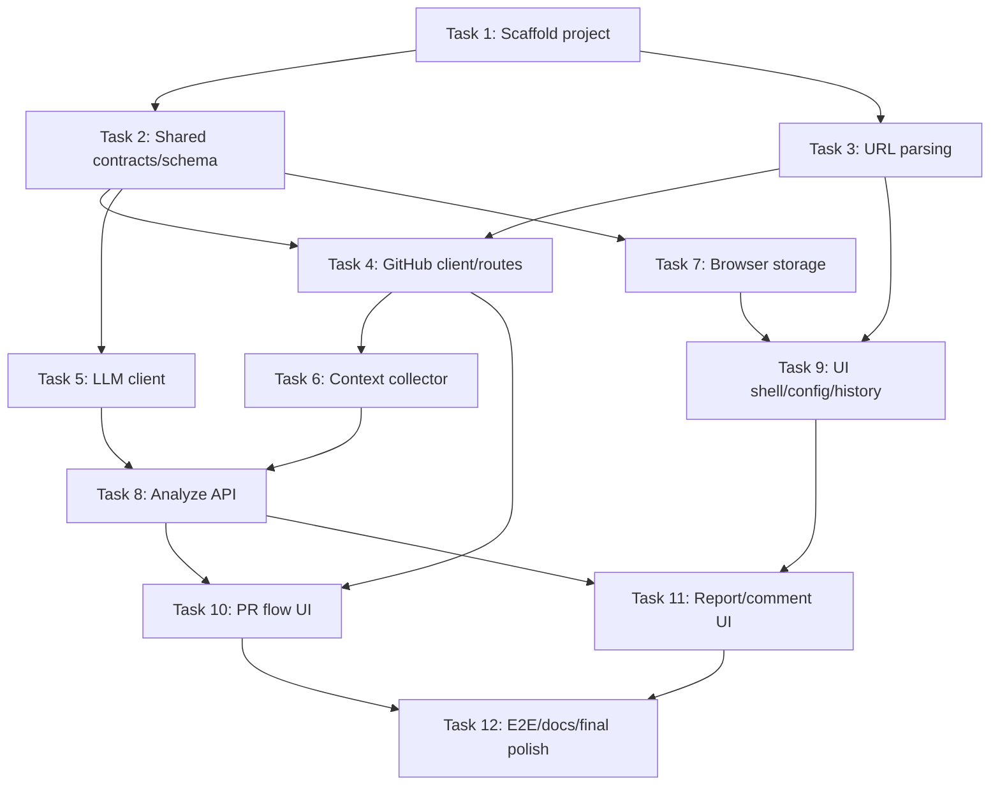

# Web PR Manager Implementation Plan

> **For agentic workers:** REQUIRED SUB-SKILL: Use superpowers:subagent-driven-development (recommended) or superpowers:executing-plans to implement this plan task-by-task. Steps use checkbox (`- [ ]`) syntax for tracking.

**Goal:** Build a local-first Next.js PR manager that analyzes GitHub pull requests with an OpenAI-compatible LLM, renders an English scored review report in a Chinese UI, saves full local history, and optionally publishes one confirmed GitHub PR comment.

**Architecture:** Use a Next.js App Router application with focused API routes for GitHub, LLM analysis, and comment publishing. Keep domain contracts in shared TypeScript modules, store secrets in browser localStorage, store complete history in IndexedDB, and validate every LLM report with a strict schema before rendering or publishing.

**Tech Stack:** TypeScript, Next.js App Router, React, Tailwind CSS, Vitest, Testing Library, MSW, Zod, idb, react-markdown, GitHub REST API, OpenAI-compatible `/v1/chat/completions`.

---

## Completion Ledger

> This ledger is updated in each task PR. A task is checked only after its worktree branch has a completion commit and verification evidence. Merge hashes are recorded in PR history; task completion commits are listed here for stable local traceability.

| Task | Status | Worktree | Branch | Completion commit(s) | Subagent | Human modifications |
| --- | --- | --- | --- | --- | --- | --- |
| Task 1 | Done | `.worktrees/task-1-scaffold` | `codex/task-1-scaffold` | `3b75b00d`, `21eb8255` | codex/task-1-scaffold implementation agent; Gemini cold-start feedback was used as review input | Codex reviewed scaffold output, resolved review feedback, and kept worktree directories ignored. |
| Task 2 | Done | `.worktrees/task-2-contracts` | `codex/task-2-contracts` | `58a957e5`, `a8191d6c`, `9da84ad5` | codex/task-2-contracts implementation agent; Gemini cold-start validation informed schema constraints | Codex hardened secret redaction and decoupled error helpers from Next server-only APIs. |
| Task 3 | Done | `.worktrees/task-3-url-parser` | `codex/task-3-url-parser` | `87094ee1`, `c7278628` | codex/task-3-url-parser implementation agent; Claude feedback clarified project root and URL boundaries | Codex tightened unsafe integer and zero PR-number handling after review. |
| Task 4 | Done | `.worktrees/task-4-github` | `codex/task-4-github` | `b6f9c5f5`, `8ea341bd` | codex/task-4-github implementation agent | Codex hardened pagination, head-repository normalization, token-scope error mapping, and route comments. |
| Task 5 | Done | `.worktrees/task-5-llm` | `codex/task-5-llm` | `cb11f72e`, `1840a4dd` | codex/task-5-llm implementation agent | Codex structured invalid-provider responses and added response_format fallback behavior. |
| Task 6 | Done | `.worktrees/task-6-context` | `codex/task-6-context` | `ef1cc90a`, `72a780d6`, `1b1282c7`, `8482b17a`, `6c3264cd` | codex/task-6-context implementation agent; Claude review called out context ownership and fake-client gaps | Codex repeatedly adjusted budget priority, head refs, overflow notes, and fake-client coverage. |
| Task 7 | Done | `.worktrees/task-7-storage` | `codex/task-7-storage` | `2e140c96`, `cae486b1` | codex/task-7-storage implementation agent | Codex hardened storage helpers for unavailable browser APIs and quota-style failures. |
| Task 8 | Done | `.worktrees/task-8-analyze` | `codex/task-8-analyze` | `4d89931e` | codex/task-8-analyze implementation agent | Codex kept /api/github/pull-detail separate from context collection and routed context ownership into /api/analyze. |
| Task 9 | Done | `.worktrees/task-9-dashboard` | `codex/task-9-dashboard` | `60d3b50b`, `e23a8a81` | codex/task-9-dashboard implementation agent | Codex hardened storage error UI and made mounted-state behavior explicit in tests. |
| Task 10 | Done | `.worktrees/task-10-pr-flow` | `codex/task-10-pr-flow` | `01ec8701`, `2b21d726`, `b56d1d90` | codex/task-10-pr-flow implementation agent | Codex fixed recoverable error-state transitions and refreshed history after successful analysis. |
| Task 11 | Done | `.worktrees/task-11-report-comment` | `codex/task-11-report-comment` | `7dffc195`, `8406e0f7`, `a55fe6f0` | codex/task-11-report-comment implementation agent | Codex added invalid comment URL validation and XSS-oriented Markdown rendering tests. |
| Task 12 | Done | `.worktrees/task-12-final-polish` | `codex/task-12-final-polish` | `f27c9bd9` | codex/task-12-final-polish implementation agent | Codex verified npm test, typecheck, lint, and build before considering the baseline done. |
| Task 13 | Done | `.worktrees/task-13-history-reopen` | `codex/task-13-history-reopen` | `8598d887` | codex/task-13-history-reopen hardening agent | Codex added the post-plan hardening task after manual review of learner workflows. |
| Task 14 | Pending | `.worktrees/task-14-llm-base-url` | `codex/task-14-llm-base-url` | - | - | - |
## Post-Plan Hardening Tasks

These tasks were added after the original twelve-task plan during final manual review and are tracked as separate worktree PRs.

- [x] **Task 13: History reopen hardening** - worktree `.worktrees/task-13-history-reopen`, branch `codex/task-13-history-reopen`, commits `8598d887`.
- [ ] **Task 14: LLM base URL validation hardening** - worktree `.worktrees/task-14-llm-base-url`, branch `codex/task-14-llm-base-url`, commits `4e337e59`.

## Completion Ledger

> This ledger is updated in each task PR. A task is checked only after its worktree branch has a completion commit and verification evidence. Merge hashes are recorded in PR history; task completion commits are listed here for stable local traceability.

| Task | Status | Worktree | Branch | Completion commit(s) | Subagent | Human modifications |
| --- | --- | --- | --- | --- | --- | --- |
| Task 1 | Done | `.worktrees/task-1-scaffold` | `codex/task-1-scaffold` | `3b75b00d`, `21eb8255` | codex/task-1-scaffold implementation agent; Gemini cold-start feedback was used as review input | Codex reviewed scaffold output, resolved review feedback, and kept worktree directories ignored. |
| Task 2 | Done | `.worktrees/task-2-contracts` | `codex/task-2-contracts` | `58a957e5`, `a8191d6c`, `9da84ad5` | codex/task-2-contracts implementation agent; Gemini cold-start validation informed schema constraints | Codex hardened secret redaction and decoupled error helpers from Next server-only APIs. |
| Task 3 | Done | `.worktrees/task-3-url-parser` | `codex/task-3-url-parser` | `87094ee1`, `c7278628` | codex/task-3-url-parser implementation agent; Claude feedback clarified project root and URL boundaries | Codex tightened unsafe integer and zero PR-number handling after review. |
| Task 4 | Done | `.worktrees/task-4-github` | `codex/task-4-github` | `b6f9c5f5`, `8ea341bd` | codex/task-4-github implementation agent | Codex hardened pagination, head-repository normalization, token-scope error mapping, and route comments. |
| Task 5 | Done | `.worktrees/task-5-llm` | `codex/task-5-llm` | `cb11f72e`, `1840a4dd` | codex/task-5-llm implementation agent | Codex structured invalid-provider responses and added response_format fallback behavior. |
| Task 6 | Done | `.worktrees/task-6-context` | `codex/task-6-context` | `ef1cc90a`, `72a780d6`, `1b1282c7`, `8482b17a`, `6c3264cd` | codex/task-6-context implementation agent; Claude review called out context ownership and fake-client gaps | Codex repeatedly adjusted budget priority, head refs, overflow notes, and fake-client coverage. |
| Task 7 | Done | `.worktrees/task-7-storage` | `codex/task-7-storage` | `2e140c96`, `cae486b1` | codex/task-7-storage implementation agent | Codex hardened storage helpers for unavailable browser APIs and quota-style failures. |
| Task 8 | Done | `.worktrees/task-8-analyze` | `codex/task-8-analyze` | `4d89931e` | codex/task-8-analyze implementation agent | Codex kept /api/github/pull-detail separate from context collection and routed context ownership into /api/analyze. |
| Task 9 | Done | `.worktrees/task-9-dashboard` | `codex/task-9-dashboard` | `60d3b50b`, `e23a8a81` | codex/task-9-dashboard implementation agent | Codex hardened storage error UI and made mounted-state behavior explicit in tests. |
| Task 10 | Done | `.worktrees/task-10-pr-flow` | `codex/task-10-pr-flow` | `01ec8701`, `2b21d726`, `b56d1d90` | codex/task-10-pr-flow implementation agent | Codex fixed recoverable error-state transitions and refreshed history after successful analysis. |
| Task 11 | Done | `.worktrees/task-11-report-comment` | `codex/task-11-report-comment` | `7dffc195`, `8406e0f7`, `a55fe6f0` | codex/task-11-report-comment implementation agent | Codex added invalid comment URL validation and XSS-oriented Markdown rendering tests. |
| Task 12 | Done | `.worktrees/task-12-final-polish` | `codex/task-12-final-polish` | `f27c9bd9` | codex/task-12-final-polish implementation agent | Codex verified npm test, typecheck, lint, and build before considering the baseline done. |
| Task 13 | Pending | `.worktrees/task-13-history-reopen` | `codex/task-13-history-reopen` | - | - | - |
| Task 14 | Pending | `.worktrees/task-14-llm-base-url` | `codex/task-14-llm-base-url` | - | - | - |
## Completion Ledger

> This ledger is updated in each task PR. A task is checked only after its worktree branch has a completion commit and verification evidence. Merge hashes are recorded in PR history; task completion commits are listed here for stable local traceability.

| Task | Status | Worktree | Branch | Completion commit(s) | Subagent | Human modifications |
| --- | --- | --- | --- | --- | --- | --- |
| Task 1 | Done | `.worktrees/task-1-scaffold` | `codex/task-1-scaffold` | `3b75b00d`, `21eb8255` | codex/task-1-scaffold implementation agent; Gemini cold-start feedback was used as review input | Codex reviewed scaffold output, resolved review feedback, and kept worktree directories ignored. |
| Task 2 | Done | `.worktrees/task-2-contracts` | `codex/task-2-contracts` | `58a957e5`, `a8191d6c`, `9da84ad5` | codex/task-2-contracts implementation agent; Gemini cold-start validation informed schema constraints | Codex hardened secret redaction and decoupled error helpers from Next server-only APIs. |
| Task 3 | Done | `.worktrees/task-3-url-parser` | `codex/task-3-url-parser` | `87094ee1`, `c7278628` | codex/task-3-url-parser implementation agent; Claude feedback clarified project root and URL boundaries | Codex tightened unsafe integer and zero PR-number handling after review. |
| Task 4 | Done | `.worktrees/task-4-github` | `codex/task-4-github` | `b6f9c5f5`, `8ea341bd` | codex/task-4-github implementation agent | Codex hardened pagination, head-repository normalization, token-scope error mapping, and route comments. |
| Task 5 | Done | `.worktrees/task-5-llm` | `codex/task-5-llm` | `cb11f72e`, `1840a4dd` | codex/task-5-llm implementation agent | Codex structured invalid-provider responses and added response_format fallback behavior. |
| Task 6 | Done | `.worktrees/task-6-context` | `codex/task-6-context` | `ef1cc90a`, `72a780d6`, `1b1282c7`, `8482b17a`, `6c3264cd` | codex/task-6-context implementation agent; Claude review called out context ownership and fake-client gaps | Codex repeatedly adjusted budget priority, head refs, overflow notes, and fake-client coverage. |
| Task 7 | Done | `.worktrees/task-7-storage` | `codex/task-7-storage` | `2e140c96`, `cae486b1` | codex/task-7-storage implementation agent | Codex hardened storage helpers for unavailable browser APIs and quota-style failures. |
| Task 8 | Done | `.worktrees/task-8-analyze` | `codex/task-8-analyze` | `4d89931e` | codex/task-8-analyze implementation agent | Codex kept /api/github/pull-detail separate from context collection and routed context ownership into /api/analyze. |
| Task 9 | Done | `.worktrees/task-9-dashboard` | `codex/task-9-dashboard` | `60d3b50b`, `e23a8a81` | codex/task-9-dashboard implementation agent | Codex hardened storage error UI and made mounted-state behavior explicit in tests. |
| Task 10 | Done | `.worktrees/task-10-pr-flow` | `codex/task-10-pr-flow` | `01ec8701`, `2b21d726`, `b56d1d90` | codex/task-10-pr-flow implementation agent | Codex fixed recoverable error-state transitions and refreshed history after successful analysis. |
| Task 11 | Done | `.worktrees/task-11-report-comment` | `codex/task-11-report-comment` | `7dffc195`, `8406e0f7`, `a55fe6f0` | codex/task-11-report-comment implementation agent | Codex added invalid comment URL validation and XSS-oriented Markdown rendering tests. |
| Task 12 | Pending | `.worktrees/task-12-final-polish` | `codex/task-12-final-polish` | - | - | - |
| Task 13 | Pending | `.worktrees/task-13-history-reopen` | `codex/task-13-history-reopen` | - | - | - |
| Task 14 | Pending | `.worktrees/task-14-llm-base-url` | `codex/task-14-llm-base-url` | - | - | - |
## Completion Ledger

> This ledger is updated in each task PR. A task is checked only after its worktree branch has a completion commit and verification evidence. Merge hashes are recorded in PR history; task completion commits are listed here for stable local traceability.

| Task | Status | Worktree | Branch | Completion commit(s) | Subagent | Human modifications |
| --- | --- | --- | --- | --- | --- | --- |
| Task 1 | Done | `.worktrees/task-1-scaffold` | `codex/task-1-scaffold` | `3b75b00d`, `21eb8255` | codex/task-1-scaffold implementation agent; Gemini cold-start feedback was used as review input | Codex reviewed scaffold output, resolved review feedback, and kept worktree directories ignored. |
| Task 2 | Done | `.worktrees/task-2-contracts` | `codex/task-2-contracts` | `58a957e5`, `a8191d6c`, `9da84ad5` | codex/task-2-contracts implementation agent; Gemini cold-start validation informed schema constraints | Codex hardened secret redaction and decoupled error helpers from Next server-only APIs. |
| Task 3 | Done | `.worktrees/task-3-url-parser` | `codex/task-3-url-parser` | `87094ee1`, `c7278628` | codex/task-3-url-parser implementation agent; Claude feedback clarified project root and URL boundaries | Codex tightened unsafe integer and zero PR-number handling after review. |
| Task 4 | Done | `.worktrees/task-4-github` | `codex/task-4-github` | `b6f9c5f5`, `8ea341bd` | codex/task-4-github implementation agent | Codex hardened pagination, head-repository normalization, token-scope error mapping, and route comments. |
| Task 5 | Done | `.worktrees/task-5-llm` | `codex/task-5-llm` | `cb11f72e`, `1840a4dd` | codex/task-5-llm implementation agent | Codex structured invalid-provider responses and added response_format fallback behavior. |
| Task 6 | Done | `.worktrees/task-6-context` | `codex/task-6-context` | `ef1cc90a`, `72a780d6`, `1b1282c7`, `8482b17a`, `6c3264cd` | codex/task-6-context implementation agent; Claude review called out context ownership and fake-client gaps | Codex repeatedly adjusted budget priority, head refs, overflow notes, and fake-client coverage. |
| Task 7 | Done | `.worktrees/task-7-storage` | `codex/task-7-storage` | `2e140c96`, `cae486b1` | codex/task-7-storage implementation agent | Codex hardened storage helpers for unavailable browser APIs and quota-style failures. |
| Task 8 | Done | `.worktrees/task-8-analyze` | `codex/task-8-analyze` | `4d89931e` | codex/task-8-analyze implementation agent | Codex kept /api/github/pull-detail separate from context collection and routed context ownership into /api/analyze. |
| Task 9 | Done | `.worktrees/task-9-dashboard` | `codex/task-9-dashboard` | `60d3b50b`, `e23a8a81` | codex/task-9-dashboard implementation agent | Codex hardened storage error UI and made mounted-state behavior explicit in tests. |
| Task 10 | Done | `.worktrees/task-10-pr-flow` | `codex/task-10-pr-flow` | `01ec8701`, `2b21d726`, `b56d1d90` | codex/task-10-pr-flow implementation agent | Codex fixed recoverable error-state transitions and refreshed history after successful analysis. |
| Task 11 | Pending | `.worktrees/task-11-report-comment` | `codex/task-11-report-comment` | - | - | - |
| Task 12 | Pending | `.worktrees/task-12-final-polish` | `codex/task-12-final-polish` | - | - | - |
| Task 13 | Pending | `.worktrees/task-13-history-reopen` | `codex/task-13-history-reopen` | - | - | - |
| Task 14 | Pending | `.worktrees/task-14-llm-base-url` | `codex/task-14-llm-base-url` | - | - | - |
## Completion Ledger

> This ledger is updated in each task PR. A task is checked only after its worktree branch has a completion commit and verification evidence. Merge hashes are recorded in PR history; task completion commits are listed here for stable local traceability.

| Task | Status | Worktree | Branch | Completion commit(s) | Subagent | Human modifications |
| --- | --- | --- | --- | --- | --- | --- |
| Task 1 | Done | `.worktrees/task-1-scaffold` | `codex/task-1-scaffold` | `3b75b00d`, `21eb8255` | codex/task-1-scaffold implementation agent; Gemini cold-start feedback was used as review input | Codex reviewed scaffold output, resolved review feedback, and kept worktree directories ignored. |
| Task 2 | Done | `.worktrees/task-2-contracts` | `codex/task-2-contracts` | `58a957e5`, `a8191d6c`, `9da84ad5` | codex/task-2-contracts implementation agent; Gemini cold-start validation informed schema constraints | Codex hardened secret redaction and decoupled error helpers from Next server-only APIs. |
| Task 3 | Done | `.worktrees/task-3-url-parser` | `codex/task-3-url-parser` | `87094ee1`, `c7278628` | codex/task-3-url-parser implementation agent; Claude feedback clarified project root and URL boundaries | Codex tightened unsafe integer and zero PR-number handling after review. |
| Task 4 | Done | `.worktrees/task-4-github` | `codex/task-4-github` | `b6f9c5f5`, `8ea341bd` | codex/task-4-github implementation agent | Codex hardened pagination, head-repository normalization, token-scope error mapping, and route comments. |
| Task 5 | Done | `.worktrees/task-5-llm` | `codex/task-5-llm` | `cb11f72e`, `1840a4dd` | codex/task-5-llm implementation agent | Codex structured invalid-provider responses and added response_format fallback behavior. |
| Task 6 | Done | `.worktrees/task-6-context` | `codex/task-6-context` | `ef1cc90a`, `72a780d6`, `1b1282c7`, `8482b17a`, `6c3264cd` | codex/task-6-context implementation agent; Claude review called out context ownership and fake-client gaps | Codex repeatedly adjusted budget priority, head refs, overflow notes, and fake-client coverage. |
| Task 7 | Done | `.worktrees/task-7-storage` | `codex/task-7-storage` | `2e140c96`, `cae486b1` | codex/task-7-storage implementation agent | Codex hardened storage helpers for unavailable browser APIs and quota-style failures. |
| Task 8 | Done | `.worktrees/task-8-analyze` | `codex/task-8-analyze` | `4d89931e` | codex/task-8-analyze implementation agent | Codex kept /api/github/pull-detail separate from context collection and routed context ownership into /api/analyze. |
| Task 9 | Done | `.worktrees/task-9-dashboard` | `codex/task-9-dashboard` | `60d3b50b`, `e23a8a81` | codex/task-9-dashboard implementation agent | Codex hardened storage error UI and made mounted-state behavior explicit in tests. |
| Task 10 | Pending | `.worktrees/task-10-pr-flow` | `codex/task-10-pr-flow` | - | - | - |
| Task 11 | Pending | `.worktrees/task-11-report-comment` | `codex/task-11-report-comment` | - | - | - |
| Task 12 | Pending | `.worktrees/task-12-final-polish` | `codex/task-12-final-polish` | - | - | - |
| Task 13 | Pending | `.worktrees/task-13-history-reopen` | `codex/task-13-history-reopen` | - | - | - |
| Task 14 | Pending | `.worktrees/task-14-llm-base-url` | `codex/task-14-llm-base-url` | - | - | - |
## Completion Ledger

> This ledger is updated in each task PR. A task is checked only after its worktree branch has a completion commit and verification evidence. Merge hashes are recorded in PR history; task completion commits are listed here for stable local traceability.

| Task | Status | Worktree | Branch | Completion commit(s) | Subagent | Human modifications |
| --- | --- | --- | --- | --- | --- | --- |
| Task 1 | Done | `.worktrees/task-1-scaffold` | `codex/task-1-scaffold` | `3b75b00d`, `21eb8255` | codex/task-1-scaffold implementation agent; Gemini cold-start feedback was used as review input | Codex reviewed scaffold output, resolved review feedback, and kept worktree directories ignored. |
| Task 2 | Done | `.worktrees/task-2-contracts` | `codex/task-2-contracts` | `58a957e5`, `a8191d6c`, `9da84ad5` | codex/task-2-contracts implementation agent; Gemini cold-start validation informed schema constraints | Codex hardened secret redaction and decoupled error helpers from Next server-only APIs. |
| Task 3 | Done | `.worktrees/task-3-url-parser` | `codex/task-3-url-parser` | `87094ee1`, `c7278628` | codex/task-3-url-parser implementation agent; Claude feedback clarified project root and URL boundaries | Codex tightened unsafe integer and zero PR-number handling after review. |
| Task 4 | Done | `.worktrees/task-4-github` | `codex/task-4-github` | `b6f9c5f5`, `8ea341bd` | codex/task-4-github implementation agent | Codex hardened pagination, head-repository normalization, token-scope error mapping, and route comments. |
| Task 5 | Done | `.worktrees/task-5-llm` | `codex/task-5-llm` | `cb11f72e`, `1840a4dd` | codex/task-5-llm implementation agent | Codex structured invalid-provider responses and added response_format fallback behavior. |
| Task 6 | Done | `.worktrees/task-6-context` | `codex/task-6-context` | `ef1cc90a`, `72a780d6`, `1b1282c7`, `8482b17a`, `6c3264cd` | codex/task-6-context implementation agent; Claude review called out context ownership and fake-client gaps | Codex repeatedly adjusted budget priority, head refs, overflow notes, and fake-client coverage. |
| Task 7 | Done | `.worktrees/task-7-storage` | `codex/task-7-storage` | `2e140c96`, `cae486b1` | codex/task-7-storage implementation agent | Codex hardened storage helpers for unavailable browser APIs and quota-style failures. |
| Task 8 | Done | `.worktrees/task-8-analyze` | `codex/task-8-analyze` | `4d89931e` | codex/task-8-analyze implementation agent | Codex kept /api/github/pull-detail separate from context collection and routed context ownership into /api/analyze. |
| Task 9 | Pending | `.worktrees/task-9-dashboard` | `codex/task-9-dashboard` | - | - | - |
| Task 10 | Pending | `.worktrees/task-10-pr-flow` | `codex/task-10-pr-flow` | - | - | - |
| Task 11 | Pending | `.worktrees/task-11-report-comment` | `codex/task-11-report-comment` | - | - | - |
| Task 12 | Pending | `.worktrees/task-12-final-polish` | `codex/task-12-final-polish` | - | - | - |
| Task 13 | Pending | `.worktrees/task-13-history-reopen` | `codex/task-13-history-reopen` | - | - | - |
| Task 14 | Pending | `.worktrees/task-14-llm-base-url` | `codex/task-14-llm-base-url` | - | - | - |
## Completion Ledger

> This ledger is updated in each task PR. A task is checked only after its worktree branch has a completion commit and verification evidence. Merge hashes are recorded in PR history; task completion commits are listed here for stable local traceability.

| Task | Status | Worktree | Branch | Completion commit(s) | Subagent | Human modifications |
| --- | --- | --- | --- | --- | --- | --- |
| Task 1 | Done | `.worktrees/task-1-scaffold` | `codex/task-1-scaffold` | `3b75b00d`, `21eb8255` | codex/task-1-scaffold implementation agent; Gemini cold-start feedback was used as review input | Codex reviewed scaffold output, resolved review feedback, and kept worktree directories ignored. |
| Task 2 | Done | `.worktrees/task-2-contracts` | `codex/task-2-contracts` | `58a957e5`, `a8191d6c`, `9da84ad5` | codex/task-2-contracts implementation agent; Gemini cold-start validation informed schema constraints | Codex hardened secret redaction and decoupled error helpers from Next server-only APIs. |
| Task 3 | Done | `.worktrees/task-3-url-parser` | `codex/task-3-url-parser` | `87094ee1`, `c7278628` | codex/task-3-url-parser implementation agent; Claude feedback clarified project root and URL boundaries | Codex tightened unsafe integer and zero PR-number handling after review. |
| Task 4 | Done | `.worktrees/task-4-github` | `codex/task-4-github` | `b6f9c5f5`, `8ea341bd` | codex/task-4-github implementation agent | Codex hardened pagination, head-repository normalization, token-scope error mapping, and route comments. |
| Task 5 | Done | `.worktrees/task-5-llm` | `codex/task-5-llm` | `cb11f72e`, `1840a4dd` | codex/task-5-llm implementation agent | Codex structured invalid-provider responses and added response_format fallback behavior. |
| Task 6 | Done | `.worktrees/task-6-context` | `codex/task-6-context` | `ef1cc90a`, `72a780d6`, `1b1282c7`, `8482b17a`, `6c3264cd` | codex/task-6-context implementation agent; Claude review called out context ownership and fake-client gaps | Codex repeatedly adjusted budget priority, head refs, overflow notes, and fake-client coverage. |
| Task 7 | Pending | `.worktrees/task-7-storage` | `codex/task-7-storage` | - | - | - |
| Task 8 | Pending | `.worktrees/task-8-analyze` | `codex/task-8-analyze` | - | - | - |
| Task 9 | Pending | `.worktrees/task-9-dashboard` | `codex/task-9-dashboard` | - | - | - |
| Task 10 | Pending | `.worktrees/task-10-pr-flow` | `codex/task-10-pr-flow` | - | - | - |
| Task 11 | Pending | `.worktrees/task-11-report-comment` | `codex/task-11-report-comment` | - | - | - |
| Task 12 | Pending | `.worktrees/task-12-final-polish` | `codex/task-12-final-polish` | - | - | - |
| Task 13 | Pending | `.worktrees/task-13-history-reopen` | `codex/task-13-history-reopen` | - | - | - |
| Task 14 | Pending | `.worktrees/task-14-llm-base-url` | `codex/task-14-llm-base-url` | - | - | - |
## Completion Ledger

> This ledger is updated in each task PR. A task is checked only after its worktree branch has a completion commit and verification evidence. Merge hashes are recorded in PR history; task completion commits are listed here for stable local traceability.

| Task | Status | Worktree | Branch | Completion commit(s) | Subagent | Human modifications |
| --- | --- | --- | --- | --- | --- | --- |
| Task 1 | Done | `.worktrees/task-1-scaffold` | `codex/task-1-scaffold` | `3b75b00d`, `21eb8255` | codex/task-1-scaffold implementation agent; Gemini cold-start feedback was used as review input | Codex reviewed scaffold output, resolved review feedback, and kept worktree directories ignored. |
| Task 2 | Done | `.worktrees/task-2-contracts` | `codex/task-2-contracts` | `58a957e5`, `a8191d6c`, `9da84ad5` | codex/task-2-contracts implementation agent; Gemini cold-start validation informed schema constraints | Codex hardened secret redaction and decoupled error helpers from Next server-only APIs. |
| Task 3 | Done | `.worktrees/task-3-url-parser` | `codex/task-3-url-parser` | `87094ee1`, `c7278628` | codex/task-3-url-parser implementation agent; Claude feedback clarified project root and URL boundaries | Codex tightened unsafe integer and zero PR-number handling after review. |
| Task 4 | Done | `.worktrees/task-4-github` | `codex/task-4-github` | `b6f9c5f5`, `8ea341bd` | codex/task-4-github implementation agent | Codex hardened pagination, head-repository normalization, token-scope error mapping, and route comments. |
| Task 5 | Done | `.worktrees/task-5-llm` | `codex/task-5-llm` | `cb11f72e`, `1840a4dd` | codex/task-5-llm implementation agent | Codex structured invalid-provider responses and added response_format fallback behavior. |
| Task 6 | Done | `.worktrees/task-6-context` | `codex/task-6-context` | `ef1cc90a`, `72a780d6`, `1b1282c7`, `8482b17a`, `6c3264cd` | codex/task-6-context implementation agent; Claude review called out context ownership and fake-client gaps | Codex repeatedly adjusted budget priority, head refs, overflow notes, and fake-client coverage. |
| Task 7 | Done | `.worktrees/task-7-storage` | `codex/task-7-storage` | `2e140c96`, `cae486b1` | codex/task-7-storage implementation agent | Codex hardened storage helpers for unavailable browser APIs and quota-style failures. |
| Task 8 | Pending | `.worktrees/task-8-analyze` | `codex/task-8-analyze` | - | - | - |
| Task 9 | Pending | `.worktrees/task-9-dashboard` | `codex/task-9-dashboard` | - | - | - |
| Task 10 | Pending | `.worktrees/task-10-pr-flow` | `codex/task-10-pr-flow` | - | - | - |
| Task 11 | Pending | `.worktrees/task-11-report-comment` | `codex/task-11-report-comment` | - | - | - |
| Task 12 | Pending | `.worktrees/task-12-final-polish` | `codex/task-12-final-polish` | - | - | - |
| Task 13 | Pending | `.worktrees/task-13-history-reopen` | `codex/task-13-history-reopen` | - | - | - |
| Task 14 | Pending | `.worktrees/task-14-llm-base-url` | `codex/task-14-llm-base-url` | - | - | - |
## Completion Ledger

> This ledger is updated in each task PR. A task is checked only after its worktree branch has a completion commit and verification evidence. Merge hashes are recorded in PR history; task completion commits are listed here for stable local traceability.

| Task | Status | Worktree | Branch | Completion commit(s) | Subagent | Human modifications |
| --- | --- | --- | --- | --- | --- | --- |
| Task 1 | Done | `.worktrees/task-1-scaffold` | `codex/task-1-scaffold` | `3b75b00d`, `21eb8255` | codex/task-1-scaffold implementation agent; Gemini cold-start feedback was used as review input | Codex reviewed scaffold output, resolved review feedback, and kept worktree directories ignored. |
| Task 2 | Done | `.worktrees/task-2-contracts` | `codex/task-2-contracts` | `58a957e5`, `a8191d6c`, `9da84ad5` | codex/task-2-contracts implementation agent; Gemini cold-start validation informed schema constraints | Codex hardened secret redaction and decoupled error helpers from Next server-only APIs. |
| Task 3 | Done | `.worktrees/task-3-url-parser` | `codex/task-3-url-parser` | `87094ee1`, `c7278628` | codex/task-3-url-parser implementation agent; Claude feedback clarified project root and URL boundaries | Codex tightened unsafe integer and zero PR-number handling after review. |
| Task 4 | Done | `.worktrees/task-4-github` | `codex/task-4-github` | `b6f9c5f5`, `8ea341bd` | codex/task-4-github implementation agent | Codex hardened pagination, head-repository normalization, token-scope error mapping, and route comments. |
| Task 5 | Done | `.worktrees/task-5-llm` | `codex/task-5-llm` | `cb11f72e`, `1840a4dd` | codex/task-5-llm implementation agent | Codex structured invalid-provider responses and added response_format fallback behavior. |
| Task 6 | Pending | `.worktrees/task-6-context` | `codex/task-6-context` | - | - | - |
| Task 7 | Pending | `.worktrees/task-7-storage` | `codex/task-7-storage` | - | - | - |
| Task 8 | Pending | `.worktrees/task-8-analyze` | `codex/task-8-analyze` | - | - | - |
| Task 9 | Pending | `.worktrees/task-9-dashboard` | `codex/task-9-dashboard` | - | - | - |
| Task 10 | Pending | `.worktrees/task-10-pr-flow` | `codex/task-10-pr-flow` | - | - | - |
| Task 11 | Pending | `.worktrees/task-11-report-comment` | `codex/task-11-report-comment` | - | - | - |
| Task 12 | Pending | `.worktrees/task-12-final-polish` | `codex/task-12-final-polish` | - | - | - |
| Task 13 | Pending | `.worktrees/task-13-history-reopen` | `codex/task-13-history-reopen` | - | - | - |
| Task 14 | Pending | `.worktrees/task-14-llm-base-url` | `codex/task-14-llm-base-url` | - | - | - |
## Completion Ledger

> This ledger is updated in each task PR. A task is checked only after its worktree branch has a completion commit and verification evidence. Merge hashes are recorded in PR history; task completion commits are listed here for stable local traceability.

| Task | Status | Worktree | Branch | Completion commit(s) | Subagent | Human modifications |
| --- | --- | --- | --- | --- | --- | --- |
| Task 1 | Done | `.worktrees/task-1-scaffold` | `codex/task-1-scaffold` | `3b75b00d`, `21eb8255` | codex/task-1-scaffold implementation agent; Gemini cold-start feedback was used as review input | Codex reviewed scaffold output, resolved review feedback, and kept worktree directories ignored. |
| Task 2 | Done | `.worktrees/task-2-contracts` | `codex/task-2-contracts` | `58a957e5`, `a8191d6c`, `9da84ad5` | codex/task-2-contracts implementation agent; Gemini cold-start validation informed schema constraints | Codex hardened secret redaction and decoupled error helpers from Next server-only APIs. |
| Task 3 | Done | `.worktrees/task-3-url-parser` | `codex/task-3-url-parser` | `87094ee1`, `c7278628` | codex/task-3-url-parser implementation agent; Claude feedback clarified project root and URL boundaries | Codex tightened unsafe integer and zero PR-number handling after review. |
| Task 4 | Done | `.worktrees/task-4-github` | `codex/task-4-github` | `b6f9c5f5`, `8ea341bd` | codex/task-4-github implementation agent | Codex hardened pagination, head-repository normalization, token-scope error mapping, and route comments. |
| Task 5 | Pending | `.worktrees/task-5-llm` | `codex/task-5-llm` | - | - | - |
| Task 6 | Pending | `.worktrees/task-6-context` | `codex/task-6-context` | - | - | - |
| Task 7 | Pending | `.worktrees/task-7-storage` | `codex/task-7-storage` | - | - | - |
| Task 8 | Pending | `.worktrees/task-8-analyze` | `codex/task-8-analyze` | - | - | - |
| Task 9 | Pending | `.worktrees/task-9-dashboard` | `codex/task-9-dashboard` | - | - | - |
| Task 10 | Pending | `.worktrees/task-10-pr-flow` | `codex/task-10-pr-flow` | - | - | - |
| Task 11 | Pending | `.worktrees/task-11-report-comment` | `codex/task-11-report-comment` | - | - | - |
| Task 12 | Pending | `.worktrees/task-12-final-polish` | `codex/task-12-final-polish` | - | - | - |
| Task 13 | Pending | `.worktrees/task-13-history-reopen` | `codex/task-13-history-reopen` | - | - | - |
| Task 14 | Pending | `.worktrees/task-14-llm-base-url` | `codex/task-14-llm-base-url` | - | - | - |
## Completion Ledger

> This ledger is updated in each task PR. A task is checked only after its worktree branch has a completion commit and verification evidence. Merge hashes are recorded in PR history; task completion commits are listed here for stable local traceability.

| Task | Status | Worktree | Branch | Completion commit(s) | Subagent | Human modifications |
| --- | --- | --- | --- | --- | --- | --- |
| Task 1 | Done | `.worktrees/task-1-scaffold` | `codex/task-1-scaffold` | `3b75b00d`, `21eb8255` | codex/task-1-scaffold implementation agent; Gemini cold-start feedback was used as review input | Codex reviewed scaffold output, resolved review feedback, and kept worktree directories ignored. |
| Task 2 | Done | `.worktrees/task-2-contracts` | `codex/task-2-contracts` | `58a957e5`, `a8191d6c`, `9da84ad5` | codex/task-2-contracts implementation agent; Gemini cold-start validation informed schema constraints | Codex hardened secret redaction and decoupled error helpers from Next server-only APIs. |
| Task 3 | Done | `.worktrees/task-3-url-parser` | `codex/task-3-url-parser` | `87094ee1`, `c7278628` | codex/task-3-url-parser implementation agent; Claude feedback clarified project root and URL boundaries | Codex tightened unsafe integer and zero PR-number handling after review. |
| Task 4 | Pending | `.worktrees/task-4-github` | `codex/task-4-github` | - | - | - |
| Task 5 | Pending | `.worktrees/task-5-llm` | `codex/task-5-llm` | - | - | - |
| Task 6 | Pending | `.worktrees/task-6-context` | `codex/task-6-context` | - | - | - |
| Task 7 | Pending | `.worktrees/task-7-storage` | `codex/task-7-storage` | - | - | - |
| Task 8 | Pending | `.worktrees/task-8-analyze` | `codex/task-8-analyze` | - | - | - |
| Task 9 | Pending | `.worktrees/task-9-dashboard` | `codex/task-9-dashboard` | - | - | - |
| Task 10 | Pending | `.worktrees/task-10-pr-flow` | `codex/task-10-pr-flow` | - | - | - |
| Task 11 | Pending | `.worktrees/task-11-report-comment` | `codex/task-11-report-comment` | - | - | - |
| Task 12 | Pending | `.worktrees/task-12-final-polish` | `codex/task-12-final-polish` | - | - | - |
| Task 13 | Pending | `.worktrees/task-13-history-reopen` | `codex/task-13-history-reopen` | - | - | - |
| Task 14 | Pending | `.worktrees/task-14-llm-base-url` | `codex/task-14-llm-base-url` | - | - | - |
## Completion Ledger

> This ledger is updated in each task PR. A task is checked only after its worktree branch has a completion commit and verification evidence. Merge hashes are recorded in PR history; task completion commits are listed here for stable local traceability.

| Task | Status | Worktree | Branch | Completion commit(s) | Subagent | Human modifications |
| --- | --- | --- | --- | --- | --- | --- |
| Task 1 | Done | `.worktrees/task-1-scaffold` | `codex/task-1-scaffold` | `3b75b00d`, `21eb8255` | codex/task-1-scaffold implementation agent; Gemini cold-start feedback was used as review input | Codex reviewed scaffold output, resolved review feedback, and kept worktree directories ignored. |
| Task 2 | Done | `.worktrees/task-2-contracts` | `codex/task-2-contracts` | `58a957e5`, `a8191d6c`, `9da84ad5` | codex/task-2-contracts implementation agent; Gemini cold-start validation informed schema constraints | Codex hardened secret redaction and decoupled error helpers from Next server-only APIs. |
| Task 3 | Pending | `.worktrees/task-3-url-parser` | `codex/task-3-url-parser` | - | - | - |
| Task 4 | Pending | `.worktrees/task-4-github` | `codex/task-4-github` | - | - | - |
| Task 5 | Pending | `.worktrees/task-5-llm` | `codex/task-5-llm` | - | - | - |
| Task 6 | Pending | `.worktrees/task-6-context` | `codex/task-6-context` | - | - | - |
| Task 7 | Pending | `.worktrees/task-7-storage` | `codex/task-7-storage` | - | - | - |
| Task 8 | Pending | `.worktrees/task-8-analyze` | `codex/task-8-analyze` | - | - | - |
| Task 9 | Pending | `.worktrees/task-9-dashboard` | `codex/task-9-dashboard` | - | - | - |
| Task 10 | Pending | `.worktrees/task-10-pr-flow` | `codex/task-10-pr-flow` | - | - | - |
| Task 11 | Pending | `.worktrees/task-11-report-comment` | `codex/task-11-report-comment` | - | - | - |
| Task 12 | Pending | `.worktrees/task-12-final-polish` | `codex/task-12-final-polish` | - | - | - |
| Task 13 | Pending | `.worktrees/task-13-history-reopen` | `codex/task-13-history-reopen` | - | - | - |
| Task 14 | Pending | `.worktrees/task-14-llm-base-url` | `codex/task-14-llm-base-url` | - | - | - |
## Completion Ledger

> This ledger is updated in each task PR. A task is checked only after its worktree branch has a completion commit and verification evidence. Merge hashes are recorded in PR history; task completion commits are listed here for stable local traceability.

| Task | Status | Worktree | Branch | Completion commit(s) | Subagent | Human modifications |
| --- | --- | --- | --- | --- | --- | --- |
| Task 1 | Done | `.worktrees/task-1-scaffold` | `codex/task-1-scaffold` | `3b75b00d`, `21eb8255` | codex/task-1-scaffold implementation agent; Gemini cold-start feedback was used as review input | Codex reviewed scaffold output, resolved review feedback, and kept worktree directories ignored. |
| Task 2 | Pending | `.worktrees/task-2-contracts` | `codex/task-2-contracts` | - | - | - |
| Task 3 | Pending | `.worktrees/task-3-url-parser` | `codex/task-3-url-parser` | - | - | - |
| Task 4 | Pending | `.worktrees/task-4-github` | `codex/task-4-github` | - | - | - |
| Task 5 | Pending | `.worktrees/task-5-llm` | `codex/task-5-llm` | - | - | - |
| Task 6 | Pending | `.worktrees/task-6-context` | `codex/task-6-context` | - | - | - |
| Task 7 | Pending | `.worktrees/task-7-storage` | `codex/task-7-storage` | - | - | - |
| Task 8 | Pending | `.worktrees/task-8-analyze` | `codex/task-8-analyze` | - | - | - |
| Task 9 | Pending | `.worktrees/task-9-dashboard` | `codex/task-9-dashboard` | - | - | - |
| Task 10 | Pending | `.worktrees/task-10-pr-flow` | `codex/task-10-pr-flow` | - | - | - |
| Task 11 | Pending | `.worktrees/task-11-report-comment` | `codex/task-11-report-comment` | - | - | - |
| Task 12 | Pending | `.worktrees/task-12-final-polish` | `codex/task-12-final-polish` | - | - | - |
| Task 13 | Pending | `.worktrees/task-13-history-reopen` | `codex/task-13-history-reopen` | - | - | - |
| Task 14 | Pending | `.worktrees/task-14-llm-base-url` | `codex/task-14-llm-base-url` | - | - | - |
## Source Spec

Design spec: `docs/superpowers/specs/2026-06-08-pr-manager-design.md`

## Project Root

The Next.js project root is `D:\AI4SE_PROJECT`. All implementation paths in this plan are relative to that repository root. The `app/` directory is the Next.js App Router directory inside the root project, not a separate nested project. Do not create a second project under `D:\AI4SE_PROJECT\app\`.

## Worktree and Parallelization Notes

Use `superpowers:using-git-worktrees` before implementation if multiple agents will work in parallel. The first task must land before any parallel work because it creates the project, package scripts, and test harness.

Dependency graph:



Parallel groups:

- After Task 1: Task 2 and Task 3 can run in parallel only if both agents coordinate exported names before merging. Prefer Task 2 first.
- After Task 2 and Task 3: Task 4, Task 5, and Task 7 can run in parallel.
- After Task 4: Task 6 can run while Task 5 and Task 7 continue.
- After Task 8 starts: Task 9 can run in parallel with backend work by using mocked API responses.
- After Task 8, Task 9, and Task 10: Task 11 and Task 12 are mostly sequential integration work.

## File Structure

Create or modify these files:

- `package.json`: scripts and dependencies.
- `next.config.ts`: Next.js config.
- `tsconfig.json`: TypeScript config.
- `vitest.config.ts`: unit and component test config.
- `vitest.setup.ts`: Testing Library and browser API setup.
- `postcss.config.mjs`, `tailwind.config.ts`, `app/globals.css`: Tailwind styling.
- `app/layout.tsx`: root layout.
- `app/page.tsx`: single-page Chinese PR manager workspace.
- `app/api/health/route.ts`: local health endpoint.
- `app/api/github/parse-url/route.ts`: URL parsing endpoint.
- `app/api/github/pulls/route.ts`: open PR listing endpoint.
- `app/api/github/pull-detail/route.ts`: PR detail preview endpoint.
- `app/api/github/comment/route.ts`: PR comment publishing endpoint.
- `app/api/analyze/route.ts`: context collection plus LLM analysis endpoint.
- `components/*.tsx`: focused UI components for settings, link input, PR picker, progress, report, review draft, history.
- `lib/types.ts`: shared domain types.
- `lib/errors.ts`: structured API errors and redaction helpers.
- `lib/url.ts`: GitHub URL parser.
- `lib/report-schema.ts`: Zod report schema and helpers.
- `lib/github.ts`: GitHub REST client.
- `lib/context.ts`: language-aware context collector and truncation.
- `lib/llm.ts`: OpenAI-compatible client and retry behavior.
- `lib/storage.ts`: localStorage and IndexedDB helpers.
- `lib/report-markdown.ts`: render validated reports to Markdown.
- `test/fixtures/*.ts`: reusable mock data.
- `test/msw/server.ts`, `test/msw/handlers.ts`: mocked HTTP handlers.
- `README.md`: local run, token scopes, safety notes.

## Task 1: Scaffold Next.js Project and Test Harness

**Dependencies:** None.

**Can run in parallel:** No. This task must complete first.

**Goal:** Create a working Next.js TypeScript application with Tailwind, Vitest, Testing Library, MSW, and a health endpoint.

**Files:**

- Create: `package.json`
- Create: `next.config.ts`
- Create: `tsconfig.json`
- Create: `vitest.config.ts`
- Create: `vitest.setup.ts`
- Create: `postcss.config.mjs`
- Create: `tailwind.config.ts`
- Create: `app/layout.tsx`
- Create: `app/page.tsx`
- Create: `app/globals.css`
- Create: `app/api/health/route.ts`
- Create: `test/health.test.ts`
- Create: `test/msw/server.ts`
- Create: `test/msw/handlers.ts`
- Create: `.gitignore`
- Modify: `README.md`

**Expected implementation points:**

- Use Next.js App Router and TypeScript.
- Add scripts: `dev`, `build`, `start`, `test`, `test:watch`, `lint`, `typecheck`.
- Add dependencies: `next`, `react`, `react-dom`, `zod`, `idb`, `react-markdown`, `lucide-react`, `clsx`, `tailwind-merge`.
- Add dev dependencies: `typescript`, `vitest`, `@vitejs/plugin-react`, `jsdom`, `fake-indexeddb`, `@testing-library/react`, `@testing-library/jest-dom`, `@testing-library/user-event`, `msw`, `tailwindcss`, `postcss`, `autoprefixer`, `eslint`, `eslint-config-next`.
- Configure `vitest.setup.ts` with `import "fake-indexeddb/auto";` so IndexedDB-backed storage tests do not crash in jsdom/Node.
- Start `app/page.tsx` with a minimal Chinese landing state that says `PR 管理器`.
- `GET /api/health` returns `{ ok: true }`.

- [x] **Step 1: Write the failing health test**

Create `test/health.test.ts`:

```ts
import { describe, expect, it } from "vitest";
import { GET } from "../app/api/health/route";

describe("GET /api/health", () => {
  it("returns ok true", async () => {
    const response = await GET();
    await expect(response.json()).resolves.toEqual({ ok: true });
  });
});
```

- [x] **Step 2: Run test to verify it fails**

Run: `npm test -- test/health.test.ts`

Expected: FAIL because `app/api/health/route.ts` does not exist yet.

- [x] **Step 3: Implement the scaffold and health route**

Create `app/api/health/route.ts`:

```ts
import { NextResponse } from "next/server";

export const dynamic = "force-dynamic";

export async function GET() {
  return NextResponse.json({ ok: true });
}
```

Create `app/page.tsx`:

```tsx
export default function HomePage() {
  return (
    <main className="min-h-screen bg-background px-6 py-8 text-foreground">
      <h1 className="text-2xl font-semibold">PR 管理器</h1>
      <p className="mt-2 text-sm text-muted-foreground">
        粘贴 GitHub 仓库或 PR 链接，生成结构化审查报告。
      </p>
    </main>
  );
}
```

Use this minimal `package.json` scripts block:

```json
{
  "scripts": {
    "dev": "next dev",
    "build": "next build",
    "start": "next start",
    "lint": "next lint",
    "typecheck": "tsc --noEmit",
    "test": "vitest run",
    "test:watch": "vitest"
  }
}
```

- [x] **Step 4: Run scaffold verification**

Run:

```powershell
npm install
npm test -- test/health.test.ts
npm run typecheck
npm run build
```

Expected: all commands pass. `npm run build` renders the starter page and compiles the health route.

- [x] **Step 5: Commit**

```powershell
git add package.json package-lock.json next.config.ts tsconfig.json vitest.config.ts vitest.setup.ts postcss.config.mjs tailwind.config.ts app test .gitignore README.md
git commit -m "chore: scaffold pr manager app"
```

## Task 2: Shared Domain Types, API Errors, and Report Schema

**Dependencies:** Task 1.

**Can run in parallel:** After Task 1, this can run before backend and frontend work. Task 3 may run in parallel if exported names are coordinated.

**Goal:** Define the shared domain model, structured error helpers, report schema validation, and Markdown rendering helpers.

**Files:**

- Create: `lib/types.ts`
- Create: `lib/errors.ts`
- Create: `lib/report-schema.ts`
- Create: `lib/report-markdown.ts`
- Create: `test/report-schema.test.ts`
- Create: `test/errors.test.ts`
- Create: `test/fixtures/report.ts`

**Expected implementation points:**

- Keep types aligned with the design spec: `RepositoryRef`, `PullRequestSummary`, `PullRequestDetail`, `ChangedFile`, `RepositoryContextFile`, `AnalysisContext`, `ScoreItem`, `AnalysisReport`, `ReviewCommentDraft`, `HistoryRecord`, `ApiError`.
- Use Zod for runtime validation.
- Enforce score range `0 <= score <= 10`.
- Enforce verdict enum: `approve`, `request_changes`, `comment`.
- Add `createApiError(code, message, details?, status?)`.
- Add `redactSecrets(value)` to remove tokens, API keys, and authorization header values from strings/objects.
- Add a `jsonError(error, fallbackCode, fallbackStatus)` helper that redacts caught errors before building `NextResponse.json(...)` route responses.
- Add `reportToMarkdown(report)` returning stable English Markdown.

- [x] **Step 1: Write failing report schema tests**

Create `test/report-schema.test.ts`:

```ts
import { describe, expect, it } from "vitest";
import { parseAnalysisReport } from "../lib/report-schema";
import { validReport } from "./fixtures/report";

describe("parseAnalysisReport", () => {
  it("accepts a complete valid report", () => {
    expect(parseAnalysisReport(validReport).overallScore).toBe(8);
  });

  it("rejects scores outside the 0 to 10 range", () => {
    expect(() =>
      parseAnalysisReport({
        ...validReport,
        overallScore: 11,
      }),
    ).toThrow(/overallScore/i);
  });

  it("rejects unknown verdict values", () => {
    expect(() =>
      parseAnalysisReport({
        ...validReport,
        verdict: "merge_now",
      }),
    ).toThrow(/verdict/i);
  });

  it("requires an overall rationale for the model-generated overall score", () => {
    const { overallRationale, ...reportWithoutRationale } = validReport;
    expect(() => parseAnalysisReport(reportWithoutRationale)).toThrow(/overallRationale/i);
  });
});
```

Create `test/errors.test.ts`:

```ts
import { describe, expect, it } from "vitest";
import { createApiError, redactSecrets } from "../lib/errors";

describe("api errors", () => {
  it("creates structured api errors", () => {
    expect(createApiError("GITHUB_UNAUTHORIZED", "Bad token", { route: "/x" }, 401)).toMatchObject({
      code: "GITHUB_UNAUTHORIZED",
      message: "Bad token",
      details: { route: "/x" },
      status: 401,
    });
  });

  it("redacts common secret fields", () => {
    expect(
      redactSecrets({
        githubToken: "ghp_secret",
        llmApiKey: "sk-secret",
        headers: { authorization: "Bearer abc" },
      }),
    ).toEqual({
      githubToken: "[REDACTED]",
      llmApiKey: "[REDACTED]",
      headers: { authorization: "[REDACTED]" },
    });
  });
});
```

- [x] **Step 2: Run tests to verify they fail**

Run: `npm test -- test/report-schema.test.ts test/errors.test.ts`

Expected: FAIL because `lib/report-schema.ts`, `lib/errors.ts`, and fixtures do not exist.

- [x] **Step 3: Implement minimal types and schema**

Create `test/fixtures/report.ts` with a valid fixed report:

```ts
import type { AnalysisReport } from "../../lib/types";

const item = {
  score: 8,
  rationale: "The implementation is coherent and evidence-backed.",
  evidence: ["The diff adds focused behavior."],
  recommendations: ["Add one more regression test."],
};

export const validReport: AnalysisReport = {
  summary: "This PR is mostly acceptable with minor follow-up suggestions.",
  scores: {
    coreFunctionality: item,
    descriptionAlignment: item,
    repositoryConventionFit: item,
    potentialIssues: item,
    testCoverage: item,
    maintainability: item,
  },
  overallScore: 8,
  overallRationale: "The PR is acceptable because the implementation is focused and the remaining concerns are minor.",
  verdict: "comment",
  reviewComment: "## Review\n\nLooks good with minor suggestions.",
  usedTruncatedContext: false,
};
```

Implement `parseAnalysisReport(input: unknown): AnalysisReport` in `lib/report-schema.ts` using Zod.

Implement `createApiError` and `redactSecrets` in `lib/errors.ts`.

- [x] **Step 4: Run schema verification**

Run:

```powershell
npm test -- test/report-schema.test.ts test/errors.test.ts
npm run typecheck
```

Expected: PASS.

- [x] **Step 5: Commit**

```powershell
git add lib/types.ts lib/errors.ts lib/report-schema.ts lib/report-markdown.ts test/report-schema.test.ts test/errors.test.ts test/fixtures/report.ts
git commit -m "feat: add shared report contracts"
```

## Task 3: GitHub URL Parser and Parse API

**Dependencies:** Task 1. Prefer Task 2 first for shared error types, but this task can run with a tiny local type and reconcile during merge.

**Can run in parallel:** Can run in parallel with Task 2 after Task 1.

**Goal:** Parse supported GitHub repository and pull request URLs and expose the parser through `/api/github/parse-url`.

**Files:**

- Create: `lib/url.ts`
- Create: `app/api/github/parse-url/route.ts`
- Create: `test/url.test.ts`
- Create: `test/api-parse-url.test.ts`

**Expected implementation points:**

- Support `https://github.com/owner/repo`.
- Support trailing slash.
- Support `https://github.com/owner/repo/pull/123`.
- Reject issue URLs, commit URLs, non-GitHub hosts, missing owner/repo, and non-numeric PR numbers.
- Return `type: "repo"` or `type: "pull"`.

- [x] **Step 1: Write failing parser tests**

Create `test/url.test.ts`:

```ts
import { describe, expect, it } from "vitest";
import { parseGitHubUrl } from "../lib/url";

describe("parseGitHubUrl", () => {
  it("parses repository urls", () => {
    expect(parseGitHubUrl("https://github.com/octo/repo")).toEqual({
      type: "repo",
      owner: "octo",
      repo: "repo",
    });
  });

  it("parses pull request urls", () => {
    expect(parseGitHubUrl("https://github.com/octo/repo/pull/42")).toEqual({
      type: "pull",
      owner: "octo",
      repo: "repo",
      pullNumber: 42,
    });
  });

  it("rejects issue urls", () => {
    expect(() => parseGitHubUrl("https://github.com/octo/repo/issues/42")).toThrow(/unsupported/i);
  });

  it("rejects non github urls", () => {
    expect(() => parseGitHubUrl("https://example.com/octo/repo")).toThrow(/github/i);
  });
});
```

Create `test/api-parse-url.test.ts`:

```ts
import { describe, expect, it } from "vitest";
import { POST } from "../app/api/github/parse-url/route";

describe("POST /api/github/parse-url", () => {
  it("returns parsed pull urls", async () => {
    const request = new Request("http://localhost/api/github/parse-url", {
      method: "POST",
      body: JSON.stringify({ url: "https://github.com/octo/repo/pull/42" }),
    });

    const response = await POST(request);
    expect(response.status).toBe(200);
    await expect(response.json()).resolves.toEqual({
      type: "pull",
      owner: "octo",
      repo: "repo",
      pullNumber: 42,
    });
  });
});
```

- [x] **Step 2: Run tests to verify they fail**

Run: `npm test -- test/url.test.ts test/api-parse-url.test.ts`

Expected: FAIL because parser and API route do not exist.

- [x] **Step 3: Implement parser and route**

Create parser signature:

```ts
export type ParsedGitHubUrl =
  | { type: "repo"; owner: string; repo: string }
  | { type: "pull"; owner: string; repo: string; pullNumber: number };

export function parseGitHubUrl(rawUrl: string): ParsedGitHubUrl {
  const url = new URL(rawUrl);
  if (url.hostname !== "github.com") {
    throw new Error("URL must use github.com");
  }
  const parts = url.pathname.split("/").filter(Boolean);
  if (parts.length === 2) {
    return { type: "repo", owner: parts[0], repo: parts[1] };
  }
  if (parts.length === 4 && parts[2] === "pull" && /^\d+$/.test(parts[3])) {
    return { type: "pull", owner: parts[0], repo: parts[1], pullNumber: Number(parts[3]) };
  }
  throw new Error("Unsupported GitHub URL");
}
```

Create route that reads JSON `{ url }`, calls parser, returns 200, and returns 400 with `INVALID_GITHUB_URL` or `UNSUPPORTED_GITHUB_URL` on failure.

- [x] **Step 4: Run parser verification**

Run:

```powershell
npm test -- test/url.test.ts test/api-parse-url.test.ts
npm run typecheck
```

Expected: PASS.

- [x] **Step 5: Commit**

```powershell
git add lib/url.ts app/api/github/parse-url/route.ts test/url.test.ts test/api-parse-url.test.ts
git commit -m "feat: parse github links"
```

## Task 4: GitHub Client, PR Routes, and Comment Publishing

**Dependencies:** Task 2 and Task 3.

**Can run in parallel:** Can run in parallel with Task 5 and Task 7.

**Goal:** Implement a GitHub REST wrapper plus API routes for listing PRs, fetching PR detail and changed files, and publishing one overall PR comment.

**Files:**

- Create: `lib/github.ts`
- Create: `app/api/github/pulls/route.ts`
- Create: `app/api/github/pull-detail/route.ts`
- Create: `app/api/github/comment/route.ts`
- Create: `test/github-client.test.ts`
- Create: `test/api-github-routes.test.ts`
- Modify: `test/msw/handlers.ts`
- Modify: `test/msw/server.ts`

**Expected implementation points:**

- Use `fetch` with `Accept: application/vnd.github+json`.
- Include `Authorization: Bearer <token>` only when token is present.
- Normalize GitHub PR responses to `PullRequestSummary`.
- Fetch changed files with pagination.
- Publish comments through `POST /repos/{owner}/{repo}/issues/{pull_number}/comments`.
- Map 401 to `GITHUB_UNAUTHORIZED`, 403 to `GITHUB_FORBIDDEN` or `GITHUB_RATE_LIMITED`, 404 to `GITHUB_REPO_NOT_FOUND` or `GITHUB_PR_NOT_FOUND` depending on operation.
- Document token expectations in route comments or README-facing errors: public repositories need readable contents/PRs plus issue comment write permission for publishing; private repositories need equivalent access to the target repository. Classic tokens are `public_repo` for public-only use and `repo` for private repository use.
- `/api/github/pull-detail` returns only `{ pullRequest }`; it must not return `changedFiles`, `contextPreview`, repository context, or truncation metadata.
- Duplicate comment protection is frontend-only in version one; the backend comment route validates one request and forwards it to GitHub without persistent idempotency storage.
- Do not log tokens.
- Every GitHub API route exports `dynamic = "force-dynamic"`.
- Every GitHub API route wraps logic in try/catch and returns only secret-redacted structured errors.

- [x] **Step 1: Write failing GitHub client tests**

Create `test/github-client.test.ts`:

```ts
import { afterAll, afterEach, beforeAll, describe, expect, it } from "vitest";
import { http, HttpResponse } from "msw";
import { server } from "./msw/server";
import { GitHubClient } from "../lib/github";

beforeAll(() => server.listen());
afterEach(() => server.resetHandlers());
afterAll(() => server.close());

describe("GitHubClient", () => {
  it("lists open pull requests", async () => {
    server.use(
      http.get("https://api.github.com/repos/octo/repo/pulls", () =>
        HttpResponse.json([
          {
            number: 42,
            title: "Fix bug",
            user: { login: "alice" },
            state: "open",
            base: { ref: "main" },
            head: { ref: "fix-bug" },
            updated_at: "2026-06-08T00:00:00Z",
            html_url: "https://github.com/octo/repo/pull/42",
          },
        ]),
      ),
    );

    const pulls = await new GitHubClient("ghp_test").listOpenPulls("octo", "repo");
    expect(pulls[0]).toMatchObject({ number: 42, title: "Fix bug", author: "alice" });
  });

  it("publishes an issue comment for a pull request", async () => {
    server.use(
      http.post("https://api.github.com/repos/octo/repo/issues/42/comments", async ({ request }) => {
        await expect(request.json()).resolves.toEqual({ body: "Looks good." });
        return HttpResponse.json({ html_url: "https://github.com/octo/repo/pull/42#issuecomment-1" });
      }),
    );

    const result = await new GitHubClient("ghp_test").createPullComment("octo", "repo", 42, "Looks good.");
    expect(result.commentUrl).toContain("issuecomment-1");
  });
});
```

Create `test/api-github-routes.test.ts`:

```ts
import { describe, expect, it, vi } from "vitest";
import { POST as listPulls } from "../app/api/github/pulls/route";
import { POST as pullDetail } from "../app/api/github/pull-detail/route";
import { POST as publishComment } from "../app/api/github/comment/route";

vi.mock("../lib/github", () => ({
  GitHubClient: vi.fn().mockImplementation(() => ({
    listOpenPulls: vi.fn(async () => [
      {
        owner: "octo",
        repo: "repo",
        number: 42,
        title: "Fix bug",
        author: "alice",
        state: "open",
        baseRef: "main",
        headRef: "fix",
        updatedAt: "2026-06-08T00:00:00Z",
        url: "https://github.com/octo/repo/pull/42",
      },
    ]),
    getPullDetail: vi.fn(async () => ({
      summary: {
        owner: "octo",
        repo: "repo",
        number: 42,
        title: "Fix bug",
        author: "alice",
        state: "open",
        baseRef: "main",
        headRef: "fix",
        updatedAt: "2026-06-08T00:00:00Z",
        url: "https://github.com/octo/repo/pull/42",
      },
      body: "Fixes a bug",
      additions: 3,
      deletions: 1,
      changedFiles: 1,
      draft: false,
    })),
    createPullComment: vi.fn(async () => ({
      commentUrl: "https://github.com/octo/repo/pull/42#issuecomment-1",
    })),
  })),
}));

describe("GitHub API routes", () => {
  it("lists open pull requests", async () => {
    const response = await listPulls(jsonRequest({ owner: "octo", repo: "repo", githubToken: "ghp_test" }));
    expect(response.status).toBe(200);
    await expect(response.json()).resolves.toMatchObject({ pulls: [{ number: 42, title: "Fix bug" }] });
  });

  it("returns only pullRequest from pull-detail", async () => {
    const response = await pullDetail(
      jsonRequest({ owner: "octo", repo: "repo", pullNumber: 42, githubToken: "ghp_test" }),
    );
    expect(response.status).toBe(200);
    const body = await response.json();
    expect(body).toHaveProperty("pullRequest");
    expect(body).not.toHaveProperty("changedFiles");
    expect(body).not.toHaveProperty("contextPreview");
  });

  it("rejects empty comment bodies", async () => {
    const response = await publishComment(
      jsonRequest({ owner: "octo", repo: "repo", pullNumber: 42, githubToken: "ghp_test", body: "" }),
    );
    expect(response.status).toBe(400);
    await expect(response.json()).resolves.toMatchObject({ code: "COMMENT_BODY_EMPTY" });
  });
});

function jsonRequest(body: unknown) {
  return new Request("http://localhost/api", {
    method: "POST",
    body: JSON.stringify(body),
  });
}
```

- [x] **Step 2: Run tests to verify they fail**

Run: `npm test -- test/github-client.test.ts`

Expected: FAIL because `lib/github.ts` does not exist.

- [x] **Step 3: Implement GitHub client and routes**

Implement class signatures:

```ts
export class GitHubClient {
  constructor(private readonly token: string) {}
  listOpenPulls(owner: string, repo: string): Promise<PullRequestSummary[]> {}
  getPullDetail(owner: string, repo: string, pullNumber: number): Promise<PullRequestDetail> {}
  listChangedFiles(owner: string, repo: string, pullNumber: number): Promise<ChangedFile[]> {}
  getFileContent(owner: string, repo: string, path: string, ref: string): Promise<string | null> {}
  createPullComment(owner: string, repo: string, pullNumber: number, body: string): Promise<{ commentUrl: string }> {}
}
```

Implement API routes that validate required fields, call the client, and return structured errors from `lib/errors.ts`. Each route file must include:

```ts
export const dynamic = "force-dynamic";
```

Each route catch block must use the shared redaction helper before returning an error:

```ts
} catch (error) {
  return jsonError(error, "GITHUB_API_ERROR", 500);
}
```

- [x] **Step 4: Run GitHub route verification**

Run:

```powershell
npm test -- test/github-client.test.ts test/api-github-routes.test.ts
npm run typecheck
```

Expected: PASS.

- [x] **Step 5: Commit**

```powershell
git add lib/github.ts app/api/github/pulls/route.ts app/api/github/pull-detail/route.ts app/api/github/comment/route.ts test/github-client.test.ts test/api-github-routes.test.ts test/msw
git commit -m "feat: add github api integration"
```

## Task 5: OpenAI-Compatible LLM Client and Prompt Contract

**Dependencies:** Task 2.

**Can run in parallel:** Can run in parallel with Task 4 and Task 7.

**Goal:** Implement a provider-agnostic LLM client that calls `/chat/completions`, extracts JSON content, validates the report schema, and retries once on invalid output.

**Files:**

- Create: `lib/llm.ts`
- Create: `test/llm-client.test.ts`
- Modify: `test/msw/handlers.ts`

**Expected implementation points:**

- Accept config `{ baseUrl, apiKey, model }`.
- Normalize base URL so both `https://host/v1` and `https://host/v1/` work.
- Send chat messages with a system prompt that enforces English report text, fixed six-dimension rubric, JSON-only response, higher-is-better scores, and logical alignment between `overallScore` and the six sub-scores.
- Include a complete JSON example matching `AnalysisReport` in the prompt.
- Try `response_format: { type: "json_object" }` on the first provider request.
- If the provider rejects `response_format` with a parameter or 400-style compatibility error, retry once without `response_format` before treating the call as failed.
- Parse JSON from `choices[0].message.content`.
- Retry once when JSON parsing or `parseAnalysisReport` fails.
- Map HTTP 401 to `LLM_UNAUTHORIZED`, 404 to `LLM_MODEL_NOT_FOUND`, timeout to `LLM_TIMEOUT`, invalid JSON after retry to `LLM_INVALID_JSON`.

- [x] **Step 1: Write failing LLM tests**

Create `test/llm-client.test.ts`:

```ts
import { afterAll, afterEach, beforeAll, describe, expect, it } from "vitest";
import { http, HttpResponse } from "msw";
import { server } from "./msw/server";
import { analyzeWithLlm } from "../lib/llm";
import { validReport } from "./fixtures/report";

beforeAll(() => server.listen());
afterEach(() => server.resetHandlers());
afterAll(() => server.close());

describe("analyzeWithLlm", () => {
  it("returns a validated report from chat completions JSON", async () => {
    server.use(
      http.post("https://llm.test/v1/chat/completions", () =>
        HttpResponse.json({
          choices: [{ message: { content: JSON.stringify(validReport) } }],
        }),
      ),
    );

    const report = await analyzeWithLlm({
      llm: { baseUrl: "https://llm.test/v1", apiKey: "sk_test", model: "model-a" },
      context: minimalAnalysisContext(),
    });
    expect(report.overallScore).toBe(8);
  });

  it("retries once after invalid JSON", async () => {
    let calls = 0;
    server.use(
      http.post("https://llm.test/v1/chat/completions", () => {
        calls += 1;
        return HttpResponse.json({
          choices: [{ message: { content: calls === 1 ? "not json" : JSON.stringify(validReport) } }],
        });
      }),
    );

    const report = await analyzeWithLlm({
      llm: { baseUrl: "https://llm.test/v1/", apiKey: "sk_test", model: "model-a" },
      context: minimalAnalysisContext(),
    });
    expect(report.verdict).toBe("comment");
    expect(calls).toBe(2);
  });

  it("falls back when response_format is rejected by the provider", async () => {
    let calls = 0;
    server.use(
      http.post("https://llm.test/v1/chat/completions", async ({ request }) => {
        calls += 1;
        const body = (await request.json()) as { response_format?: unknown };
        if (body.response_format) {
          return HttpResponse.json({ error: { message: "Unknown parameter: response_format" } }, { status: 400 });
        }
        return HttpResponse.json({
          choices: [{ message: { content: JSON.stringify(validReport) } }],
        });
      }),
    );

    const report = await analyzeWithLlm({
      llm: { baseUrl: "https://llm.test/v1", apiKey: "sk_test", model: "model-a" },
      context: minimalAnalysisContext(),
    });
    expect(report.overallScore).toBe(8);
    expect(calls).toBe(2);
  });
});

function minimalAnalysisContext() {
  return {
    repository: { owner: "octo", repo: "repo", url: "https://github.com/octo/repo" },
    pullRequest: {
      summary: {
        owner: "octo",
        repo: "repo",
        number: 42,
        title: "Fix bug",
        author: "alice",
        state: "open",
        baseRef: "main",
        headRef: "fix",
        updatedAt: "2026-06-08T00:00:00Z",
        url: "https://github.com/octo/repo/pull/42",
      },
      body: "Fixes a bug",
      additions: 3,
      deletions: 1,
      changedFiles: 1,
      draft: false,
    },
    changedFiles: [
      {
        filename: "src/feature.ts",
        status: "modified",
        additions: 3,
        deletions: 1,
        changes: 4,
        patch: "@@ -1 +1\n-old\n+new",
        isBinary: false,
        truncated: false,
      },
    ],
    contextFiles: [
      {
        path: "package.json",
        kind: "package",
        content: "{\"scripts\":{\"test\":\"vitest\"}}",
        truncated: false,
      },
    ],
    detectedLanguages: ["TypeScript"],
    truncated: false,
    truncationNotes: [],
  };
}
```

- [x] **Step 2: Run tests to verify they fail**

Run: `npm test -- test/llm-client.test.ts`

Expected: FAIL because `lib/llm.ts` does not exist.

- [x] **Step 3: Implement LLM client**

Implement signature:

```ts
export type LlmConfig = { baseUrl: string; apiKey: string; model: string };

export async function analyzeWithLlm(input: {
  llm: LlmConfig;
  context: AnalysisContext;
}): Promise<AnalysisReport> {
  // Build messages, try JSON response_format, fall back on provider parameter errors,
  // parse JSON, validate, and retry once for invalid model output.
}
```

Use `AbortSignal.timeout(60000)` for the request timeout.

- [x] **Step 4: Run LLM verification**

Run:

```powershell
npm test -- test/llm-client.test.ts
npm run typecheck
```

Expected: PASS.

- [x] **Step 5: Commit**

```powershell
git add lib/llm.ts test/llm-client.test.ts test/msw/handlers.ts
git commit -m "feat: add llm analysis client"
```

## Task 6: Language-Aware Context Collector and Truncation

**Dependencies:** Task 4.

**Can run in parallel:** Can run after Task 4 while Task 5 or Task 7 continue.

**Goal:** Build `AnalysisContext` from GitHub PR data, changed files, language-aware repository files, file snippets, and deterministic truncation notes.

**Files:**

- Create: `lib/context.ts`
- Create: `test/context.test.ts`
- Modify: `lib/github.ts` if file-content helpers need small adjustments.

**Expected implementation points:**

- Detect candidate languages from changed file extensions and repository file names.
- Use canonical language labels exactly as specified in the spec: `TypeScript`, `JavaScript`, `Python`, `Java`, `Go`, `Other`.
- Map repository context file `kind` exactly as specified in the spec's "Language and Context Mapping" section.
- Candidate context paths:
  - JS/TS: `package.json`, `tsconfig.json`, `.eslintrc`, `.eslintrc.json`, `eslint.config.js`, `.prettierrc`, `prettier.config.js`, `jest.config.js`, `vitest.config.ts`, `next.config.ts`.
  - Python: `pyproject.toml`, `requirements.txt`, `setup.cfg`, `ruff.toml`, `mypy.ini`, `pytest.ini`.
  - Java: `pom.xml`, `build.gradle`, `checkstyle.xml`, `spotbugs.xml`.
  - Go: `go.mod`, `go.sum`, `.golangci.yml`.
  - Common: `README.md`, `README`, `CONTRIBUTING.md`, `CONTRIBUTING`, `.github/pull_request_template.md`.
- Use a fixed character budget such as `MAX_CONTEXT_CHARS = 120000` for version one.
- Do not build context by concatenating everything and slicing at `MAX_CONTEXT_CHARS`.
- Allocate context budget by priority:
  - PR metadata and description: always include fully.
  - Changed file summaries and diff headers: high priority.
  - Changed file patches: apply a per-file soft limit such as `MAX_PATCH_CHARS = 8000`.
  - Repository context files: apply a per-file soft limit such as `MAX_REPO_CONTEXT_FILE_CHARS = 5000`.
  - Stop loading additional low-priority files when the total budget is exhausted.
- Insert local markers such as `[Patch truncated due to file-size limit]` when truncating a patch.
- Skip binary files and files with no text content.
- Mark each truncated file and the full context when truncation occurs.

- [x] **Step 1: Write failing context tests**

Create `test/context.test.ts`:

```ts
import { describe, expect, it, vi } from "vitest";
import { collectAnalysisContext } from "../lib/context";

describe("collectAnalysisContext", () => {
  it("adds TypeScript repository context for TypeScript changes", async () => {
    const github = fakeGitHubClient({
      changedFiles: [{ filename: "app/page.tsx", patch: "@@ patch", isBinary: false }],
      files: {
        "package.json": '{"scripts":{"test":"vitest"}}',
        "tsconfig.json": '{"compilerOptions":{"strict":true}}',
      },
    });

    const context = await collectAnalysisContext(github, "octo", "repo", 42);
    expect(context.detectedLanguages).toContain("TypeScript");
    expect(context.contextFiles.map((file) => file.path)).toEqual(
      expect.arrayContaining(["package.json", "tsconfig.json"]),
    );
  });

  it("marks context as truncated when content exceeds budget", async () => {
    const github = fakeGitHubClient({
      changedFiles: [{ filename: "src/main.py", patch: "x".repeat(200000), isBinary: false }],
      files: { "pyproject.toml": "[tool.pytest.ini_options]" },
    });

    const context = await collectAnalysisContext(github, "octo", "repo", 42, { maxChars: 1000 });
    expect(context.truncated).toBe(true);
    expect(context.truncationNotes.length).toBeGreaterThan(0);
  });

  it("does not let one huge patch starve repository context", async () => {
    const github = fakeGitHubClient({
      changedFiles: [
        { filename: "src/generated.ts", patch: "x".repeat(200000), isBinary: false },
        { filename: "src/feature.ts", patch: "@@ small useful patch", isBinary: false },
      ],
      files: {
        "package.json": '{"scripts":{"test":"vitest"}}',
      },
    });

    const context = await collectAnalysisContext(github, "octo", "repo", 42, {
      maxChars: 12000,
      maxPatchChars: 4000,
      maxRepoContextFileChars: 2000,
    });

    expect(context.changedFiles.find((file) => file.filename === "src/generated.ts")?.truncated).toBe(true);
    expect(context.changedFiles.find((file) => file.filename === "src/feature.ts")?.patch).toContain("small useful");
    expect(context.contextFiles.map((file) => file.path)).toContain("package.json");
    expect(context.truncationNotes.join("\n")).toContain("Patch truncated");
  });
});
```

Add this complete `fakeGitHubClient` helper in the same test. The method names must match Task 4's `GitHubClient` API exactly:

```ts
function fakeGitHubClient(input: {
  changedFiles: Array<{
    filename: string;
    patch?: string;
    isBinary: boolean;
    status?: string;
    additions?: number;
    deletions?: number;
    changes?: number;
  }>;
  files: Record<string, string>;
}) {
  return {
    getPullDetail: vi.fn(async () => ({
      summary: {
        owner: "octo",
        repo: "repo",
        number: 42,
        title: "Fix bug",
        author: "alice",
        state: "open",
        baseRef: "main",
        headRef: "fix",
        updatedAt: "2026-06-08T00:00:00Z",
        url: "https://github.com/octo/repo/pull/42",
      },
      body: "Fixes a bug",
      additions: 3,
      deletions: 1,
      changedFiles: input.changedFiles.length,
      draft: false,
    })),
    listChangedFiles: vi.fn(async () =>
      input.changedFiles.map((file) => ({
        filename: file.filename,
        status: file.status ?? "modified",
        additions: file.additions ?? 1,
        deletions: file.deletions ?? 0,
        changes: file.changes ?? 1,
        patch: file.patch,
        isBinary: file.isBinary,
        truncated: false,
      })),
    ),
    getFileContent: vi.fn(async (_owner: string, _repo: string, path: string) => input.files[path] ?? null),
  };
}
```

- [x] **Step 2: Run tests to verify they fail**

Run: `npm test -- test/context.test.ts`

Expected: FAIL because `lib/context.ts` does not exist.

- [x] **Step 3: Implement context collector**

Implement signature:

```ts
export async function collectAnalysisContext(
  github: Pick<GitHubClient, "getPullDetail" | "listChangedFiles" | "getFileContent">,
  owner: string,
  repo: string,
  pullNumber: number,
  options: { maxChars?: number; maxPatchChars?: number; maxRepoContextFileChars?: number } = {},
): Promise<AnalysisContext> {
  // Fetch PR detail, changed files, context files, snippets, and truncation metadata.
}
```

- [x] **Step 4: Run context verification**

Run:

```powershell
npm test -- test/context.test.ts
npm run typecheck
```

Expected: PASS.

- [x] **Step 5: Commit**

```powershell
git add lib/context.ts test/context.test.ts lib/github.ts
git commit -m "feat: collect pull request context"
```

## Task 7: Browser Configuration and IndexedDB History Storage

**Dependencies:** Task 2.

**Can run in parallel:** Can run in parallel with Task 4 and Task 5.

**Goal:** Implement client-side storage helpers for localStorage config and complete IndexedDB history without storing secrets in history records.

**Files:**

- Create: `lib/storage.ts`
- Create: `test/storage.test.ts`

**Expected implementation points:**

- Export `loadAppConfig`, `saveAppConfig`, `hasCompleteConfig`.
- Export `saveHistoryRecord`, `listHistoryRecords`, `getHistoryRecord`, `deleteHistoryRecord`, `clearHistoryRecords`.
- Use `idb` for IndexedDB.
- Keep config in localStorage under a stable key like `pr-manager-config`.
- Keep history in IndexedDB database `pr-manager`, store `history`.
- Reject history records that include secret-looking keys such as `githubToken`, `llmApiKey`, `apiKey`, or `authorization`.

- [x] **Step 1: Write failing storage tests**

Create `test/storage.test.ts`:

```ts
import { beforeEach, describe, expect, it } from "vitest";
import { clearHistoryRecords, listHistoryRecords, loadAppConfig, saveAppConfig, saveHistoryRecord } from "../lib/storage";
import { validReport } from "./fixtures/report";

beforeEach(async () => {
  localStorage.clear();
  await clearHistoryRecords();
});

describe("storage", () => {
  it("saves and loads app config from localStorage", () => {
    saveAppConfig({
      githubToken: "ghp_test",
      llmBaseUrl: "https://llm.test/v1",
      llmApiKey: "sk_test",
      llmModel: "model-a",
    });
    expect(loadAppConfig()?.llmModel).toBe("model-a");
  });

  it("saves full history records in IndexedDB", async () => {
    await saveHistoryRecord({
      id: "record-1",
      createdAt: "2026-06-08T00:00:00Z",
      repository: { owner: "octo", repo: "repo", url: "https://github.com/octo/repo" },
      pullRequest: {
        owner: "octo",
        repo: "repo",
        number: 42,
        title: "Fix bug",
        author: "alice",
        state: "open",
        baseRef: "main",
        headRef: "fix",
        updatedAt: "2026-06-08T00:00:00Z",
        url: "https://github.com/octo/repo/pull/42",
      },
      report: validReport,
      reviewDraft: { body: validReport.reviewComment, sourceReportId: "record-1" },
      contextSummary: { changedFileCount: 1, contextFileCount: 2, truncated: false },
    });

    const records = await listHistoryRecords();
    expect(records).toHaveLength(1);
    expect(records[0].report.reviewComment).toContain("Review");
  });
});
```

- [x] **Step 2: Run tests to verify they fail**

Run: `npm test -- test/storage.test.ts`

Expected: FAIL because `lib/storage.ts` does not exist.

- [x] **Step 3: Implement storage helpers**

Implement the named functions in `lib/storage.ts`. For tests, ensure Vitest setup provides an IndexedDB polyfill such as `fake-indexeddb` if jsdom does not provide it.

- [x] **Step 4: Run storage verification**

Run:

```powershell
npm test -- test/storage.test.ts
npm run typecheck
```

Expected: PASS.

- [x] **Step 5: Commit**

```powershell
git add lib/storage.ts test/storage.test.ts vitest.setup.ts package.json package-lock.json
git commit -m "feat: add local config and history storage"
```

## Task 8: Analyze API Orchestration

**Dependencies:** Task 5 and Task 6.

**Can run in parallel:** Mostly backend integration. UI tasks can continue against mocked response shape while this lands.

**Goal:** Implement `/api/analyze` by validating config, collecting context, calling the LLM client, validating the report, and returning structured errors.

**Files:**

- Create: `app/api/analyze/route.ts`
- Create: `test/api-analyze.test.ts`
- Modify: `lib/errors.ts` if route-specific error helpers need refinement.

**Expected implementation points:**

- Validate required fields: `owner`, `repo`, `pullNumber`, `githubToken`, `llm.baseUrl`, `llm.apiKey`, `llm.model`.
- Instantiate `GitHubClient`.
- Call `collectAnalysisContext`.
- Call `analyzeWithLlm` with the collected `AnalysisContext`.
- Do not build the LLM prompt in the route. The route owns orchestration only; `lib/llm.ts` owns `AnalysisContext` to prompt/messages conversion, JSON example insertion, `response_format` fallback, and report schema parsing.
- Return `{ report }`.
- Return `CONFIG_MISSING` for missing fields.
- Return structured errors without leaking secrets.
- Export `dynamic = "force-dynamic"` from the route file.
- Wrap route logic in try/catch and return `jsonError(error, "SERVER_ERROR", 500)` or a more specific redacted structured error.

- [x] **Step 1: Write failing analyze API tests**

Create `test/api-analyze.test.ts`:

```ts
import { describe, expect, it, vi } from "vitest";
import { POST } from "../app/api/analyze/route";
import { validReport } from "./fixtures/report";

vi.mock("../lib/context", () => ({
  collectAnalysisContext: vi.fn(async () => ({
    repository: { owner: "octo", repo: "repo", url: "https://github.com/octo/repo" },
    pullRequest: {
      summary: {
        owner: "octo",
        repo: "repo",
        number: 42,
        title: "Fix bug",
        author: "alice",
        state: "open",
        baseRef: "main",
        headRef: "fix",
        updatedAt: "2026-06-08T00:00:00Z",
        url: "https://github.com/octo/repo/pull/42",
      },
      body: "Fixes a bug",
      additions: 3,
      deletions: 1,
      changedFiles: 1,
      draft: false,
    },
    changedFiles: [],
    contextFiles: [],
    detectedLanguages: ["TypeScript"],
    truncated: false,
    truncationNotes: [],
  })),
}));

vi.mock("../lib/llm", () => ({
  analyzeWithLlm: vi.fn(async () => validReport),
}));

describe("POST /api/analyze", () => {
  it("returns a validated report", async () => {
    const request = new Request("http://localhost/api/analyze", {
      method: "POST",
      body: JSON.stringify({
        owner: "octo",
        repo: "repo",
        pullNumber: 42,
        githubToken: "ghp_test",
        llm: { baseUrl: "https://llm.test/v1", apiKey: "sk_test", model: "model-a" },
      }),
    });

    const response = await POST(request);
    expect(response.status).toBe(200);
    await expect(response.json()).resolves.toEqual({ report: validReport });
  });

  it("rejects missing config", async () => {
    const response = await POST(
      new Request("http://localhost/api/analyze", {
        method: "POST",
        body: JSON.stringify({ owner: "octo" }),
      }),
    );
    expect(response.status).toBe(400);
    await expect(response.json()).resolves.toMatchObject({ code: "CONFIG_MISSING" });
  });
});
```

- [x] **Step 2: Run tests to verify they fail**

Run: `npm test -- test/api-analyze.test.ts`

Expected: FAIL because `app/api/analyze/route.ts` does not exist.

- [x] **Step 3: Implement analyze route**

Create route with:

```ts
export const dynamic = "force-dynamic";

export async function POST(request: Request) {
  const body = await request.json();
  // Validate fields, create GitHubClient, collect context, analyze with LLM, return report.
}
```

Use `NextResponse.json(errorBody, { status })` for structured errors, and use the shared redaction helper in all catch paths.

- [x] **Step 4: Run analyze verification**

Run:

```powershell
npm test -- test/api-analyze.test.ts
npm run typecheck
```

Expected: PASS.

- [x] **Step 5: Commit**

```powershell
git add app/api/analyze/route.ts test/api-analyze.test.ts lib/errors.ts
git commit -m "feat: orchestrate pull request analysis"
```

## Task 9: Chinese Dashboard Shell, Settings, Link Input, and History Panel

**Dependencies:** Task 3 and Task 7.

**Can run in parallel:** Can run with Task 8 by mocking backend API responses.

**Goal:** Build the Vercel-style Chinese dashboard shell with local settings persistence, GitHub link input, status regions, and local history list controls.

**Files:**

- Modify: `app/page.tsx`
- Create: `components/SettingsPanel.tsx`
- Create: `components/LinkInput.tsx`
- Create: `components/HistoryPanel.tsx`
- Create: `components/StatusMessage.tsx`
- Create: `lib/ui.ts`
- Create: `test/ui-settings-history.test.tsx`

**Expected implementation points:**

- Chinese UI labels.
- Settings panel persists config with `saveAppConfig`.
- Config panel expands when config is incomplete.
- Link input accepts repository and PR URLs.
- History panel lists records from IndexedDB and supports delete and clear all.
- `SettingsPanel` and `HistoryPanel` must use a `mounted` state and read localStorage or IndexedDB only inside `useEffect` or client-only event handlers.
- The initial server-render-compatible UI must be stable, such as a loading skeleton or empty state, so React does not produce hydration mismatch warnings when browser storage loads.
- Use restrained dashboard layout: no landing hero, no marketing copy, no nested cards.

- [x] **Step 1: Write failing UI tests**

Create `test/ui-settings-history.test.tsx`:

```tsx
import { render, screen, waitFor } from "@testing-library/react";
import userEvent from "@testing-library/user-event";
import { beforeEach, describe, expect, it, vi } from "vitest";
import HomePage from "../app/page";
import { loadAppConfig } from "../lib/storage";

beforeEach(() => {
  localStorage.clear();
});

describe("dashboard shell", () => {
  it("saves settings from the Chinese settings panel", async () => {
    render(<HomePage />);
    await userEvent.type(screen.getByLabelText("GitHub Token"), "ghp_test");
    await userEvent.type(screen.getByLabelText("LLM Base URL"), "https://llm.test/v1");
    await userEvent.type(screen.getByLabelText("LLM API Key"), "sk_test");
    await userEvent.type(screen.getByLabelText("模型"), "model-a");
    await userEvent.click(screen.getByRole("button", { name: "保存配置" }));
    expect(loadAppConfig()?.llmModel).toBe("model-a");
  });

  it("shows the link input workspace", () => {
    render(<HomePage />);
    expect(screen.getByLabelText("GitHub 链接")).toBeInTheDocument();
    expect(screen.getByRole("button", { name: "加载" })).toBeInTheDocument();
  });

  it("does not read browser storage during initial render", () => {
    const getItemSpy = vi.spyOn(Storage.prototype, "getItem");
    render(<HomePage />);
    expect(getItemSpy).not.toHaveBeenCalled();
  });

  it("loads saved config after client effects run", async () => {
    localStorage.setItem(
      "pr-manager-config",
      JSON.stringify({
        githubToken: "ghp_test",
        llmBaseUrl: "https://llm.test/v1",
        llmApiKey: "sk_test",
        llmModel: "model-a",
      }),
    );
    render(<HomePage />);
    await waitFor(() => expect(screen.getByDisplayValue("model-a")).toBeInTheDocument());
  });
});
```

- [x] **Step 2: Run tests to verify they fail**

Run: `npm test -- test/ui-settings-history.test.tsx`

Expected: FAIL because UI components and storage wiring are not implemented.

- [x] **Step 3: Implement shell components**

Implement accessible labels exactly as used in tests:

- `GitHub Token`
- `LLM Base URL`
- `LLM API Key`
- `模型`
- `GitHub 链接`
- Button `保存配置`
- Button `加载`

Use `useEffect` to load config and history only on the client. Add `const [mounted, setMounted] = useState(false)` in storage-backed components, set it to true in an effect, and render a stable loading or empty state until mounted.

- [x] **Step 4: Run UI shell verification**

Run:

```powershell
npm test -- test/ui-settings-history.test.tsx
npm run typecheck
```

Expected: PASS.

- [x] **Step 5: Commit**

```powershell
git add app/page.tsx components/SettingsPanel.tsx components/LinkInput.tsx components/HistoryPanel.tsx components/StatusMessage.tsx lib/ui.ts test/ui-settings-history.test.tsx
git commit -m "feat: add local dashboard shell"
```

## Task 10: PR Selection and Analysis Flow UI

**Dependencies:** Task 4, Task 8, and Task 9.

**Can run in parallel:** Can start with mocked API calls after Task 9, then rebase onto Task 8.

**Goal:** Connect the UI flow from pasted URL to PR list or direct PR summary, then trigger analysis with visible progress states.

**Files:**

- Modify: `app/page.tsx`
- Create: `components/PullRequestPicker.tsx`
- Create: `components/PullRequestSummary.tsx`
- Create: `components/AnalysisProgress.tsx`
- Create: `lib/client-api.ts`
- Create: `test/ui-pr-flow.test.tsx`

**Expected implementation points:**

- Repository URL flow:
  - Parse URL.
  - Fetch `/api/github/pulls`.
  - Show open PR list and filter by title/number.
- PR URL flow:
  - Parse URL.
  - Fetch `/api/github/pull-detail`.
  - Show PR summary directly.
- Analyze button:
  - Disabled when config or PR target is missing.
  - Shows stages: fetching PR, collecting context, calling LLM, validating report, saving history.
  - Calls `/api/analyze`.
- State transition rules:
  - `idle` -> `repoLoaded` when a repository URL parses and `/api/github/pulls` succeeds.
  - `idle` -> `prReady` when a PR URL parses and `/api/github/pull-detail` succeeds.
  - `repoLoaded` -> `prReady` when the user selects a PR from the list.
  - `prReady` -> `analyzing` when the user clicks `开始分析` with complete config.
  - `analyzing` -> `done` when `/api/analyze` returns a schema-valid report and local history save completes.
  - Any state -> `error` when a parse, GitHub, LLM, validation, or storage operation fails.
  - `error` -> previous recoverable state when the user edits the URL, updates config, chooses another PR, or clicks retry. Keep the last valid PR selection when the error came from analysis or comment publishing; reset to `idle` when the error came from URL parsing.

- [x] **Step 1: Write failing PR flow tests**

Create `test/ui-pr-flow.test.tsx`:

```tsx
import { render, screen, waitFor } from "@testing-library/react";
import userEvent from "@testing-library/user-event";
import { beforeEach, describe, expect, it, vi } from "vitest";
import HomePage from "../app/page";

beforeEach(() => {
  localStorage.setItem(
    "pr-manager-config",
    JSON.stringify({
      githubToken: "ghp_test",
      llmBaseUrl: "https://llm.test/v1",
      llmApiKey: "sk_test",
      llmModel: "model-a",
    }),
  );
  vi.stubGlobal(
    "fetch",
    vi.fn(async (url: string) => {
      if (url.includes("/api/github/parse-url")) {
        return jsonResponse({ type: "repo", owner: "octo", repo: "repo" });
      }
      if (url.includes("/api/github/pulls")) {
        return jsonResponse({
          pulls: [
            {
              owner: "octo",
              repo: "repo",
              number: 42,
              title: "Fix bug",
              author: "alice",
              state: "open",
              baseRef: "main",
              headRef: "fix",
              updatedAt: "2026-06-08T00:00:00Z",
              url: "https://github.com/octo/repo/pull/42",
            },
          ],
        });
      }
      return jsonResponse({});
    }),
  );
});

describe("PR flow UI", () => {
  it("loads open PRs from a repository URL", async () => {
    render(<HomePage />);
    await userEvent.type(screen.getByLabelText("GitHub 链接"), "https://github.com/octo/repo");
    await userEvent.click(screen.getByRole("button", { name: "加载" }));
    await waitFor(() => expect(screen.getByText("#42 Fix bug")).toBeInTheDocument());
  });
});

function jsonResponse(body: unknown) {
  return Promise.resolve(new Response(JSON.stringify(body), { status: 200 }));
}
```

- [x] **Step 2: Run tests to verify they fail**

Run: `npm test -- test/ui-pr-flow.test.tsx`

Expected: FAIL because PR flow is not wired.

- [x] **Step 3: Implement client API and PR flow components**

Implement `lib/client-api.ts` functions:

```ts
export async function postJson<TResponse>(url: string, body: unknown): Promise<TResponse> {}
export async function parseUrl(url: string) {}
export async function listPulls(input: { owner: string; repo: string; githubToken: string }) {}
export async function getPullDetail(input: { owner: string; repo: string; pullNumber: number; githubToken: string }) {}
export async function analyzePullRequest(input: AnalyzeRequest) {}
```

Wire `app/page.tsx` states: `idle`, `repoLoaded`, `prReady`, `analyzing`, `done`, `error`.

- [x] **Step 4: Run PR flow verification**

Run:

```powershell
npm test -- test/ui-pr-flow.test.tsx
npm run typecheck
```

Expected: PASS.

- [x] **Step 5: Commit**

```powershell
git add app/page.tsx components/PullRequestPicker.tsx components/PullRequestSummary.tsx components/AnalysisProgress.tsx lib/client-api.ts test/ui-pr-flow.test.tsx
git commit -m "feat: connect pull request selection flow"
```

## Task 11: Report Rendering, Review Draft Publishing, and History Save

**Dependencies:** Task 8, Task 9, and Task 10.

**Can run in parallel:** No. This task integrates backend response, local history, and publishing controls.

**Goal:** Render validated reports, save completed analyses to IndexedDB, show/copy review drafts, and publish one confirmed GitHub PR comment.

**Files:**

- Modify: `app/page.tsx`
- Create: `components/ScoreOverview.tsx`
- Create: `components/ReportViewer.tsx`
- Create: `components/ReviewDraft.tsx`
- Create: `test/ui-report-comment.test.tsx`

**Expected implementation points:**

- Render six dimension scores and overall score.
- Render English Markdown with `react-markdown`.
- Do not render raw HTML from Markdown. Use `react-markdown` with HTML skipped, or add `rehype-sanitize` if later enabling HTML-like content.
- Show a visible truncated-context notice when `usedTruncatedContext` is true.
- Save a full `HistoryRecord` only after `/api/analyze` returns a schema-valid report. Create `HistoryRecord.id` first, use that same value as `ReviewCommentDraft.sourceReportId`, then save the history record before moving UI state from `analyzing` to `done`. If history save fails, show a storage error and keep the generated report/draft in memory without marking it as persisted.
- Publish button requires confirmation, disables during request, and calls `/api/github/comment`.
- Failed publish keeps the draft visible and copyable.

- [x] **Step 1: Write failing report/comment tests**

Create `test/ui-report-comment.test.tsx`:

```tsx
import { render, screen, waitFor } from "@testing-library/react";
import userEvent from "@testing-library/user-event";
import { beforeEach, describe, expect, it, vi } from "vitest";
import HomePage from "../app/page";
import { validReport } from "./fixtures/report";

beforeEach(() => {
  localStorage.setItem(
    "pr-manager-config",
    JSON.stringify({
      githubToken: "ghp_test",
      llmBaseUrl: "https://llm.test/v1",
      llmApiKey: "sk_test",
      llmModel: "model-a",
    }),
  );
  vi.stubGlobal("confirm", vi.fn(() => true));
});

describe("report and comment UI", () => {
  it("renders analysis report and publishes a confirmed comment", async () => {
    vi.stubGlobal(
      "fetch",
      vi.fn(async (url: string) => {
        if (url.includes("/api/github/parse-url")) {
          return jsonResponse({ type: "pull", owner: "octo", repo: "repo", pullNumber: 42 });
        }
        if (url.includes("/api/github/pull-detail")) {
          return jsonResponse({ pullRequest: pullSummary() });
        }
        if (url.includes("/api/analyze")) {
          return jsonResponse({ report: validReport });
        }
        if (url.includes("/api/github/comment")) {
          return jsonResponse({ commentUrl: "https://github.com/octo/repo/pull/42#issuecomment-1" });
        }
        return jsonResponse({});
      }),
    );

    render(<HomePage />);
    await userEvent.type(screen.getByLabelText("GitHub 链接"), "https://github.com/octo/repo/pull/42");
    await userEvent.click(screen.getByRole("button", { name: "加载" }));
    await userEvent.click(await screen.findByRole("button", { name: "开始分析" }));
    await waitFor(() => expect(screen.getByText("Overall Score")).toBeInTheDocument());
    await userEvent.click(screen.getByRole("button", { name: "发布评论" }));
    await waitFor(() => expect(screen.getByText(/评论已发布/)).toBeInTheDocument());
  });

  it("does not render raw html from markdown reports", async () => {
    const unsafeReport = {
      ...validReport,
      reviewComment: "Safe text ",
      summary: "Summary <script>alert(1)</script>",
    };
    vi.stubGlobal(
      "fetch",
      vi.fn(async (url: string) => {
        if (url.includes("/api/github/parse-url")) {
          return jsonResponse({ type: "pull", owner: "octo", repo: "repo", pullNumber: 42 });
        }
        if (url.includes("/api/github/pull-detail")) {
          return jsonResponse({ pullRequest: pullSummary() });
        }
        if (url.includes("/api/analyze")) {
          return jsonResponse({ report: unsafeReport });
        }
        return jsonResponse({});
      }),
    );

    render(<HomePage />);
    await userEvent.type(screen.getByLabelText("GitHub 链接"), "https://github.com/octo/repo/pull/42");
    await userEvent.click(screen.getByRole("button", { name: "加载" }));
    await userEvent.click(await screen.findByRole("button", { name: "开始分析" }));
    await waitFor(() => expect(screen.getByText(/Safe text/)).toBeInTheDocument());
    expect(document.querySelector("script")).toBeNull();
    expect(document.querySelector("img[onerror]")).toBeNull();
  });
});

function jsonResponse(body: unknown) {
  return Promise.resolve(new Response(JSON.stringify(body), { status: 200 }));
}

function pullSummary() {
  return {
    owner: "octo",
    repo: "repo",
    number: 42,
    title: "Fix bug",
    author: "alice",
    state: "open",
    baseRef: "main",
    headRef: "fix",
    updatedAt: "2026-06-08T00:00:00Z",
    url: "https://github.com/octo/repo/pull/42",
  };
}
```

- [x] **Step 2: Run tests to verify they fail**

Run: `npm test -- test/ui-report-comment.test.tsx`

Expected: FAIL because report rendering and publishing are not wired.

- [x] **Step 3: Implement report and publishing UI**

Add these components:

- `ScoreOverview`: overall score plus six compact dimension rows.
- `ReportViewer`: Markdown report rendering from `reportToMarkdown(report)`.
- `ReviewDraft`: textarea or Markdown preview with copy and publish buttons.

On successful analysis, create a `HistoryRecord` with generated `crypto.randomUUID()`, set `reviewDraft.sourceReportId` to that same history id, call `saveHistoryRecord`, and only then mark the UI as `done`.

- [x] **Step 4: Run report verification**

Run:

```powershell
npm test -- test/ui-report-comment.test.tsx test/storage.test.ts
npm run typecheck
```

Expected: PASS.

- [x] **Step 5: Commit**

```powershell
git add app/page.tsx components/ScoreOverview.tsx components/ReportViewer.tsx components/ReviewDraft.tsx test/ui-report-comment.test.tsx
git commit -m "feat: render reports and publish comments"
```

## Task 12: Mocked End-to-End Test, Documentation, and Final Verification

**Dependencies:** Tasks 1 through 11.

**Can run in parallel:** No. Final integration pass.

**Goal:** Add one mocked happy-path integration test, update README with local usage and scopes, run full verification, and fix integration issues.

**Files:**

- Create: `test/happy-path.test.tsx`
- Modify: `README.md`
- Modify: any file needed to fix integration failures found by verification.

**Expected implementation points:**

- Test the full mocked path: repository URL, PR selection, analysis, report rendering, history save.
- README must include:
  - local install/run commands
  - GitHub token permissions for public and private repos
  - OpenAI-compatible config fields
  - example model guidance: use a provider-supported fast/cost-effective model such as `gpt-4o-mini` when available
  - fixed version-one context budget of `120000` characters
  - warning that public deployment is not recommended
  - statement that UI is Chinese and generated review is English
- Run all tests, typecheck, lint, and build.

- [x] **Step 1: Write failing happy-path test**

Create `test/happy-path.test.tsx`:

```tsx
import { render, screen, waitFor } from "@testing-library/react";
import userEvent from "@testing-library/user-event";
import { beforeEach, describe, expect, it, vi } from "vitest";
import HomePage from "../app/page";
import { listHistoryRecords } from "../lib/storage";
import { validReport } from "./fixtures/report";

beforeEach(async () => {
  localStorage.setItem(
    "pr-manager-config",
    JSON.stringify({
      githubToken: "ghp_test",
      llmBaseUrl: "https://llm.test/v1",
      llmApiKey: "sk_test",
      llmModel: "model-a",
    }),
  );
});

describe("happy path", () => {
  it("loads a repository, selects a PR, analyzes it, renders report, and saves history", async () => {
    vi.stubGlobal(
      "fetch",
      vi.fn(async (url: string) => {
        if (url.includes("/api/github/parse-url")) return jsonResponse({ type: "repo", owner: "octo", repo: "repo" });
        if (url.includes("/api/github/pulls")) return jsonResponse({ pulls: [pullSummary()] });
        if (url.includes("/api/github/pull-detail")) {
          return jsonResponse({ pullRequest: pullSummary() });
        }
        if (url.includes("/api/analyze")) return jsonResponse({ report: validReport });
        return jsonResponse({});
      }),
    );

    render(<HomePage />);
    await userEvent.type(screen.getByLabelText("GitHub 链接"), "https://github.com/octo/repo");
    await userEvent.click(screen.getByRole("button", { name: "加载" }));
    await userEvent.click(await screen.findByText("#42 Fix bug"));
    await userEvent.click(screen.getByRole("button", { name: "开始分析" }));
    await waitFor(() => expect(screen.getByText("Overall Score")).toBeInTheDocument());

    await waitFor(async () => {
      expect(await listHistoryRecords()).toHaveLength(1);
    });
  });
});

function jsonResponse(body: unknown) {
  return Promise.resolve(new Response(JSON.stringify(body), { status: 200 }));
}

function pullSummary() {
  return {
    owner: "octo",
    repo: "repo",
    number: 42,
    title: "Fix bug",
    author: "alice",
    state: "open",
    baseRef: "main",
    headRef: "fix",
    updatedAt: "2026-06-08T00:00:00Z",
    url: "https://github.com/octo/repo/pull/42",
  };
}
```

- [x] **Step 2: Run test to verify it fails if integration is incomplete**

Run: `npm test -- test/happy-path.test.tsx`

Expected before fixes: FAIL if any integration edge is missing. Expected after fixes: PASS.

- [x] **Step 3: Update README**

Include this minimum README structure:

````md
# Web PR Manager

Local-first PR review assistant for personal developers and students.

## Run Locally

```powershell
npm install
npm run dev
```

Open http://localhost:3000.

## Credentials

Store credentials in the settings panel. They are saved in browser localStorage and sent only to local API routes during requests.

GitHub token permissions:
- Public repositories: read access to repository contents and pull requests; comment permission to publish a PR comment.
- Private repositories: token must have access to the target private repository plus permission to create issue comments.

LLM settings:
- Base URL, for example `https://api.openai.com/v1`
- API key
- Model name. For OpenAI-compatible providers, start with a fast/cost-effective model such as `gpt-4o-mini` when your provider supports it, or enter any model name supported by your configured provider.

## Context Budget

Version one uses a fixed 120,000 character analysis context budget. Large PRs are truncated with visible per-file and report-level notices.

## Safety

Do not deploy version one to an untrusted public server. The browser sends secrets to the app server for GitHub and LLM requests.

## Language

The UI is Chinese. Generated analysis reports and GitHub comments are English.
````

- [x] **Step 4: Run full verification**

Run:

```powershell
npm test
npm run typecheck
npm run lint
npm run build
```

Expected: all commands pass.

- [x] **Step 5: Manual local smoke test**

Run:

```powershell
npm run dev
```

Open `http://localhost:3000` in the browser. Verify:

- Settings panel accepts config.
- GitHub link input is visible.
- Repository URL path can show mocked or real PRs depending on credentials.
- PR URL path can reach analysis-ready state.
- Report page does not overlap or resize awkwardly at desktop width.

- [x] **Step 6: Commit**

```powershell
git add test/happy-path.test.tsx README.md .
git commit -m "test: add end-to-end pr review flow"
```

## Final Acceptance Checklist

- [x] Repository URL lists open PRs.
- [x] PR URL goes directly to PR-ready state.
- [x] Missing config blocks analysis with Chinese messages.
- [x] GitHub token and LLM API key never appear in logs, UI errors, or history.
- [x] API routes export `dynamic = "force-dynamic"` and return only redacted structured errors.
- [x] Settings/history components read localStorage and IndexedDB only after client mount.
- [x] Analysis report has six fixed dimensions plus overall score.
- [x] Every score is 0-10 and higher means more acceptable.
- [x] Overall score is model-generated but explained against the six sub-scores.
- [x] LLM client falls back when a provider rejects `response_format`.
- [x] Report body and review draft are English.
- [x] Markdown rendering skips or sanitizes raw HTML.
- [x] UI labels and workflow are Chinese.
- [x] User must confirm before publishing a single PR comment.
- [x] Failed publishing keeps the draft copyable.
- [x] Full analysis history persists in IndexedDB with no automatic limit.
- [x] Single-record delete and clear-all history controls work.
- [x] Large or truncated context displays a truncation notice.
- [x] `npm test` passes.
- [x] `npm run typecheck` passes.
- [x] `npm run lint` passes.
- [x] `npm run build` passes.

## Self-Review Notes

Spec coverage:

- Problem statement and user stories are covered by Tasks 9 through 12.
- Functional modules are covered by Tasks 2 through 11.
- Non-functional requirements are covered by schema validation, redaction, prioritized truncation, mounted-state storage access, Markdown HTML sanitization, progress UI, and final verification.
- Architecture and data model are covered by Tasks 1 through 8.
- API design is covered by Tasks 3, 4, and 8.
- Technology choices are covered by Task 1 and README updates in Task 12.
- Acceptance criteria are represented in the final checklist.
- Risks are addressed by prioritized truncation, schema validation, `response_format` fallback, redacted route errors, mounted-state storage reads, Markdown HTML sanitization, explicit confirmation, and local-only README warnings.

Forbidden-marker scan:

- The plan was checked for unfinished-marker strings and vague implementation gaps.

Type consistency:

- Later tasks use names introduced earlier: `AnalysisReport`, `AnalysisContext`, `HistoryRecord`, `GitHubClient`, `parseGitHubUrl`, `analyzeWithLlm`, `collectAnalysisContext`, and storage helper names.
