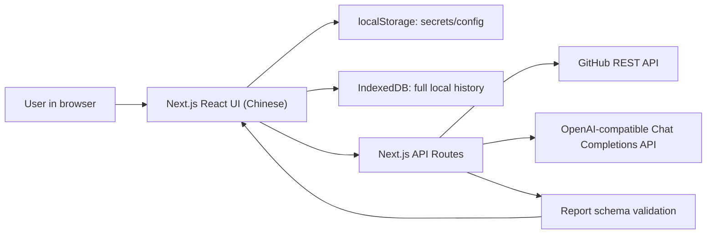

# Web PR Manager Design Spec

Date: 2026-06-08

## 1. Problem Statement

Individual developers and students often need to review GitHub pull requests, but they may not know which dimensions to inspect, how to compare the PR description with the code changes, or how to write clear review feedback in English. Manual review is also slow when the reviewer must inspect diffs, repository conventions, tests, and potential risks without a structured checklist.

This project builds a local-first web PR manager. A user pastes a GitHub repository URL or pull request URL, selects a PR when needed, and asks an OpenAI-compatible LLM to analyze the PR using GitHub metadata, diffs, repository conventions, and changed-file context. The app renders an English Markdown review report with fixed scoring dimensions and an overall score, then lets the user publish a confirmed overall PR comment to GitHub.

The first version targets personal developers and students. It is worth building because it lowers the code review learning barrier, improves first-pass PR triage, and helps users generate usable English review comments without introducing multi-user accounts, server-side credential storage, or enterprise workflow complexity.

## 2. User Stories

1. As an individual developer, I want to paste a GitHub repository URL and choose an open PR, so that I do not need to manually find a pull request number before starting analysis.

   Acceptance: Given a valid repository URL and a GitHub token with access, the app lists open PRs with number, title, author, branch, and update time.

2. As a student, I want to paste a specific GitHub PR URL, so that I can quickly run one code review exercise.

   Acceptance: Given a valid PR URL, the app skips repository PR selection and loads the selected PR summary directly.

3. As a beginning reviewer, I want to see fixed scoring dimensions with reasons and evidence, so that I can learn what a useful PR review should consider.

   Acceptance: The analysis report always includes Core Functionality, Description Alignment, Repository Convention Fit, Potential Issues, Test Coverage, Maintainability, and Overall Score.

4. As a GitHub user, I want to review the generated English comment before publishing it, so that I can avoid accidental or low-quality comments.

   Acceptance: The app never posts automatically. It only publishes a single overall PR comment after explicit user confirmation.

5. As a local-tool user, I want my GitHub token, LLM settings, and analysis history to stay in my browser, so that I can use the app without creating an account.

   Acceptance: Secrets are stored in browser localStorage, full analysis history is stored in browser IndexedDB, and the server does not persist either.

6. As a private repository user, I want the tool to work when my token has sufficient permissions, so that the app is useful beyond public repositories.

   Acceptance: Private repository reads and comment publishing work with an authorized token; insufficient permissions produce clear errors rather than ambiguous "not found" states.

7. As a learner, I want to revisit past analysis reports, so that I can compare different PRs and review outcomes over time.

   Acceptance: Completed analysis reports persist after refresh and can be viewed, deleted individually, or cleared entirely.

## 3. Functional Specification

### 3.1 Configuration Management

- Input: GitHub token, LLM base URL, LLM API key, LLM model.
- Behavior: Store configuration in browser localStorage. Include the configuration in requests to local API routes when required.
- Output: Configuration status showing whether required fields are present.
- Boundary conditions: Do not write secrets to server disk, Git history, IndexedDB history records, logs, or error messages. Because Next.js App Router renders on the server by default, UI components must not read localStorage during server render or initial render. Storage reads must happen after client mount inside effects, with a stable loading or empty state to avoid hydration mismatch.
- Error handling: Show field-specific messages for missing token, invalid base URL, missing model, invalid API key, model not found, and LLM connectivity failures.

### 3.2 Link Parsing and PR Selection

- Input: GitHub repository URL such as `https://github.com/owner/repo`, or PR URL such as `https://github.com/owner/repo/pull/123`.
- Behavior: Parse `owner`, `repo`, and optional `pullNumber`. Repository URLs load open PRs. PR URLs load the target PR directly.
- Output: A PR list for repository URLs, or a selected PR summary for PR URLs.
- Boundary conditions: Only GitHub repository and pull request URLs are supported in version one. Issue URLs, commit URLs, non-GitHub URLs, and malformed URLs are rejected.
- Error handling: Return explicit errors for invalid URL, unauthorized token, missing repository, no open PRs, rate limit, and GitHub network failure.

### 3.3 Context Collection

- Input: `owner`, `repo`, `pullNumber`, and GitHub token.
- Behavior: Fetch PR metadata, changed files, file patches, diff summaries, and language-specific repository context files. Fetch relevant changed-file content snippets when text content is available.
- Output: A normalized `AnalysisContext`.
- Boundary conditions: Skip binary files and oversized files. Enforce a fixed version-one context budget of `120000` characters. Do not concatenate all context and slice blindly. Allocate budget by priority: PR metadata and description must be preserved first; changed file summaries and diff headers are next; changed file patches receive a per-file soft limit such as `8000` characters; repository context files receive a smaller per-file limit such as `5000` characters; further files are skipped when the total budget is exhausted. Mark each shortened file with `truncated=true`, insert a local truncation note such as `[Patch truncated due to file-size limit]`, and mark the whole context as truncated when any truncation or skip occurs.
- Error handling: Continue with partial context where safe, but surface missing permissions, GitHub pagination failures, and context-size truncation to the final report.

Language-aware context files:

- JavaScript/TypeScript: `package.json`, `tsconfig.json`, ESLint config, Prettier config, Jest/Vitest config, Next.js config.
- Python: `pyproject.toml`, `requirements.txt`, `setup.cfg`, Ruff config, mypy config, pytest config.
- Java: `pom.xml`, `build.gradle`, Checkstyle config, SpotBugs config.
- Go: `go.mod`, `go.sum`, golangci-lint config.
- Common: `README*`, `CONTRIBUTING*`, `.github/pull_request_template*`, `.github/workflows/*` when relevant and within limits.

### 3.4 LLM Analysis

- Input: `AnalysisContext`, fixed rubric, English output instruction, LLM base URL, LLM API key, and model.
- Behavior: Call an OpenAI-compatible Chat Completions API. Ask the model to return strict JSON matching the report schema, and include a complete example JSON object in the prompt. Try `response_format: { "type": "json_object" }` when supported, but fall back to ordinary chat completion if the provider rejects that parameter. Retry once when JSON parsing or schema validation fails.
- Output: A validated `AnalysisReport`.
- Boundary conditions: Scores must be numeric values from 0 to 10. Verdict must be `approve`, `request_changes`, or `comment`. Higher scores always mean the PR is more acceptable. The model generates `overallScore`, but the prompt must require logical alignment with the six sub-scores and allow severe issues to dominate the overall score when warranted.
- Error handling: Return structured errors for timeout, invalid key, unknown model, unsupported API response shape, invalid JSON after retry, and schema validation failure.

### 3.5 Report Rendering

- Input: `AnalysisReport`.
- Behavior: Render the app UI in Chinese while keeping report text and GitHub review comment in English. Display score overview, per-dimension detail, Markdown report, and review comment draft.
- Output: Human-readable report, copyable Markdown, and publish-ready review draft.
- Boundary conditions: Do not publish automatically. Show a truncation notice when context was truncated. Markdown rendering must not execute or render raw HTML from LLM output, PR descriptions, diffs, or repository snippets; use `react-markdown` with HTML skipped or an explicit sanitization layer.
- Error handling: If fields are missing or invalid, show a report validation error and prevent comment publishing.

### 3.6 Comment Publishing

- Input: Target PR, generated review comment, GitHub token.
- Behavior: Publish one overall PR comment through GitHub's issue comments API after explicit user confirmation.
- Output: Success status and comment URL when available.
- Boundary conditions: No line-level comments in version one. Disable or debounce the publish button while a request is in flight.
- Error handling: Show clear errors for missing permissions, locked conversations, rate limit, duplicate in-flight submission, and network failure. Keep the draft available for copy or retry.

### 3.7 Local History

- Input: PR metadata, analysis report, review comment draft, scores, verdict, timestamps, truncation status.
- Behavior: Save complete analysis records to browser IndexedDB with no automatic retention limit. Allow viewing, deleting one record, and clearing all records.
- Output: Local history list and detail view.
- Boundary conditions: History is local to the current browser profile and does not sync across devices. Secrets must not be stored in history records. Like configuration, IndexedDB access must happen only after client mount inside effects or client-only handlers to avoid server-render crashes and hydration mismatch.
- Error handling: If IndexedDB writes fail because of browser quota or privacy settings, show a message recommending deletion, export, or browser setting changes.

## 4. Non-Functional Requirements

### Performance

- Medium and small PRs should return analysis within 60 seconds under normal GitHub and LLM API conditions.
- GitHub context fetching should use safe concurrency for independent files and pages.
- Large PRs may be truncated. The report must clearly state when truncated context was used.

### Security

- GitHub token and LLM API key are stored only in browser localStorage for version one.
- Local API routes receive secrets only for the current request and must not write them to disk.
- Logs and error messages must redact tokens, API keys, authorization headers, and raw secret-bearing payloads.
- Every API route must use standardized try/catch error handling that redacts secrets before returning errors to the browser.
- Public and private repositories are supported when token permissions allow access.
- Public deployment is not recommended for version one because browser-stored secrets are sent to the app server during API calls.

### Usability

- The UI language is Chinese.
- Analysis report and GitHub comment text are English.
- Main states must be explicit: idle, repository loaded, PR ready, analyzing, done, and error.
- The app must show progress stages: fetching PR, collecting context, calling LLM, validating report, and saving history.
- Users can copy generated comments even when publishing fails.

### Observability

- API routes return structured error codes and user-readable messages.
- Development logs may include request stage and timing, but never secrets.
- Frontend state should expose enough status for users to know whether failure came from GitHub, LLM, schema validation, or local storage.

### Reliability

- LLM schema validation is required before rendering a report as complete.
- Invalid JSON gets one automatic retry.
- Providers that reject `response_format` must be retried without that parameter before surfacing a provider error.
- Publishing comments requires explicit confirmation and disables duplicate in-flight submission.
- Partial GitHub context collection is allowed only when the missing data is non-critical and clearly recorded.

### Compatibility

- Target modern desktop browsers.
- Mobile layout should not be broken, but mobile-first optimization is not required for version one.
- The app is designed for local Next.js execution.

## 5. System Architecture

The app is a Next.js single-repository application with a React frontend, local API routes, and shared TypeScript libraries.



### Components

- Frontend workspace: Link input, settings panel, PR picker, PR summary, analysis progress, report viewer, review draft, history panel.
- API routes: GitHub URL parsing, PR listing, PR detail/context collection, LLM analysis, comment publishing, health check.
- Library layer:
  - `lib/url.ts`: GitHub URL parsing and validation.
  - `lib/github.ts`: GitHub REST API wrapper.
  - `lib/context.ts`: language-aware context collection and truncation.
  - `lib/llm.ts`: OpenAI-compatible API client.
  - `lib/report-schema.ts`: report schema and validation.
  - `lib/storage.ts`: browser storage types and helpers.

### Data Flow

1. User saves local configuration in the settings panel.
2. User pastes a repository URL or PR URL.
3. Frontend parses or asks the local API to parse the target.
4. Repository URL flow lists open PRs; PR URL flow loads the target PR.
5. User clicks Analyze.
6. API route fetches GitHub metadata, diffs, and language-aware context.
7. API route calls the LLM with strict English instructions and fixed rubric.
8. API route validates the structured report.
9. Frontend renders the report and saves it to IndexedDB.
10. User optionally confirms publishing one GitHub PR comment.

### External Dependencies

- GitHub REST API for repositories, pull requests, files, diffs, and issue comments.
- OpenAI-compatible Chat Completions API for analysis.
- Browser localStorage for configuration secrets.
- Browser IndexedDB for local report history.

## 6. Data Model

### AppConfig

- `githubToken: string`
- `llmBaseUrl: string`
- `llmApiKey: string`
- `llmModel: string`
- Constraint: Stored in localStorage only. Never copied into history.

### RepositoryRef

- `owner: string`
- `repo: string`
- `url: string`

### PullRequestSummary

- `owner: string`
- `repo: string`
- `number: number`
- `title: string`
- `author: string`
- `state: "open" | "closed"`
- `baseRef: string`
- `headRef: string`
- `updatedAt: string`
- `url: string`

### PullRequestDetail

- `summary: PullRequestSummary`
- `body: string`
- `additions: number`
- `deletions: number`
- `changedFiles: number`
- `mergeable?: boolean`
- `draft: boolean`

### ChangedFile

- `filename: string`
- `status: string`
- `additions: number`
- `deletions: number`
- `changes: number`
- `patch?: string`
- `rawUrl?: string`
- `isBinary: boolean`
- `contentSnippet?: string`
- `truncated: boolean`

### RepositoryContextFile

- `path: string`
- `kind: "readme" | "contributing" | "package" | "lint" | "test" | "build" | "ci" | "language" | "other"`
- `content: string`
- `truncated: boolean`

### AnalysisContext

- `repository: RepositoryRef`
- `pullRequest: PullRequestDetail`
- `changedFiles: ChangedFile[]`
- `contextFiles: RepositoryContextFile[]`
- `detectedLanguages: string[]`
- `truncated: boolean`
- `truncationNotes: string[]`

### ScoreItem

- `score: number`
- `rationale: string`
- `evidence: string[]`
- `recommendations: string[]`
- Constraint: `score` is 0-10.

### AnalysisReport

- `summary: string`
- `scores.coreFunctionality: ScoreItem`
- `scores.descriptionAlignment: ScoreItem`
- `scores.repositoryConventionFit: ScoreItem`
- `scores.potentialIssues: ScoreItem`
- `scores.testCoverage: ScoreItem`
- `scores.maintainability: ScoreItem`
- `overallScore: number`
- `verdict: "approve" | "request_changes" | "comment"`
- `reviewComment: string`
- `usedTruncatedContext: boolean`
- Constraint: `overallScore` is 0-10.

### ReviewCommentDraft

- `body: string`
- `sourceReportId: string`
- `publishedAt?: string`
- `githubCommentUrl?: string`

### HistoryRecord

- `id: string`
- `createdAt: string`
- `repository: RepositoryRef`
- `pullRequest: PullRequestSummary`
- `report: AnalysisReport`
- `reviewDraft: ReviewCommentDraft`
- `contextSummary: { changedFileCount: number; contextFileCount: number; truncated: boolean }`
- Constraint: Stored in IndexedDB. No GitHub token or LLM API key.

### ApiError

- `code: string`
- `message: string`
- `details?: Record<string, unknown>`

## 7. API Design

All API routes use JSON requests and responses. Any request containing secrets must be handled only in memory. All App Router API route files must export `dynamic = "force-dynamic"` to avoid accidental static optimization assumptions, even though POST routes are normally dynamic.

All API routes share this reliability contract:

- Validate required fields before calling GitHub or LLM providers.
- Wrap route logic in try/catch.
- Redact secrets from caught errors before returning JSON.
- Return structured `ApiError` responses with stable `code`, `message`, and optional sanitized `details`.
- Never echo GitHub tokens, LLM API keys, authorization headers, or raw secret-bearing request bodies.

### POST /api/github/parse-url

Request:

```json
{ "url": "https://github.com/owner/repo/pull/123" }
```

Success:

```json
{ "type": "pull", "owner": "owner", "repo": "repo", "pullNumber": 123 }
```

Errors: `INVALID_GITHUB_URL`, `UNSUPPORTED_GITHUB_URL`.

### POST /api/github/pulls

Request:

```json
{ "owner": "owner", "repo": "repo", "githubToken": "..." }
```

Success:

```json
{ "pulls": [{ "number": 123, "title": "Fix issue", "author": "octocat", "state": "open", "baseRef": "main", "headRef": "fix", "updatedAt": "2026-06-08T00:00:00Z", "url": "https://github.com/owner/repo/pull/123" }] }
```

Errors: `GITHUB_UNAUTHORIZED`, `GITHUB_FORBIDDEN`, `GITHUB_REPO_NOT_FOUND`, `GITHUB_RATE_LIMITED`, `GITHUB_API_ERROR`.

### POST /api/github/pull-detail

Request:

```json
{ "owner": "owner", "repo": "repo", "pullNumber": 123, "githubToken": "..." }
```

Success:

```json
{ "pullRequest": {}, "changedFiles": [], "contextPreview": { "truncated": false, "detectedLanguages": ["TypeScript"] } }
```

Errors: `GITHUB_UNAUTHORIZED`, `GITHUB_PR_NOT_FOUND`, `GITHUB_RATE_LIMITED`, `CONTEXT_COLLECTION_FAILED`.

### POST /api/analyze

Request:

```json
{
  "owner": "owner",
  "repo": "repo",
  "pullNumber": 123,
  "githubToken": "...",
  "llm": { "baseUrl": "https://api.openai.com/v1", "apiKey": "...", "model": "gpt-4.1" }
}
```

Success:

```json
{
  "report": {
    "summary": "string",
    "scores": {},
    "overallScore": 8,
    "verdict": "comment",
    "reviewComment": "markdown string",
    "usedTruncatedContext": false
  }
}
```

Errors: `CONFIG_MISSING`, `CONTEXT_COLLECTION_FAILED`, `LLM_UNAUTHORIZED`, `LLM_MODEL_NOT_FOUND`, `LLM_TIMEOUT`, `LLM_INVALID_JSON`, `REPORT_SCHEMA_INVALID`.

### POST /api/github/comment

Request:

```json
{ "owner": "owner", "repo": "repo", "pullNumber": 123, "githubToken": "...", "body": "markdown string" }
```

Success:

```json
{ "commentUrl": "https://github.com/owner/repo/pull/123#issuecomment-1" }
```

Errors: `GITHUB_UNAUTHORIZED`, `GITHUB_FORBIDDEN`, `GITHUB_PR_NOT_FOUND`, `GITHUB_CONVERSATION_LOCKED`, `GITHUB_RATE_LIMITED`, `COMMENT_BODY_EMPTY`, `COMMENT_PUBLISH_FAILED`.

### GET /api/health

Success:

```json
{ "ok": true }
```

## 8. Technology Choices and Rationale

- Language: TypeScript. It keeps frontend, API routes, GitHub wrappers, LLM wrappers, and schema types aligned.
- Framework: Next.js App Router. It supports a local full-stack web tool with React UI and API routes in one codebase.
- Frontend: React with Tailwind CSS and shadcn/ui or small local components. The app is a working dashboard, not a landing page.
- Open Design design system: `vercel`.
- Open Design skill: `dashboard`.
- Open Design rationale: Open Design documents `dashboard` as the admin/analytics style skill and lists `vercel` among developer-tool design systems. This project is a developer productivity dashboard for PR review, so the Vercel-style system fits the target audience: minimal, technical, focused, and suitable for dense metadata, score cards, progress states, and Markdown reports.
- Storage: localStorage for configuration secrets, IndexedDB for complete local history, no backend database.
- Test storage support: Vitest must load `fake-indexeddb/auto` in `vitest.setup.ts` so IndexedDB tests run in jsdom/Node.
- External APIs: GitHub REST API and OpenAI-compatible Chat Completions API.
- Deployment: Local Next.js execution for version one. Public deployment requires redesigned credential handling, authentication, and server-side secret isolation.

## 9. Acceptance Criteria

### Configuration

- The app blocks analysis when required GitHub or LLM fields are missing.
- The app saves configuration in localStorage and restores it after refresh.
- Settings and history UI do not read localStorage or IndexedDB before client mount and do not produce hydration mismatch warnings.
- Token and API key never appear in UI errors, console logs, history records, or server logs.

### Link Parsing and PR Selection

- A valid repository URL lists open PRs.
- A valid PR URL loads the target PR without showing the PR picker first.
- Invalid GitHub URLs show a clear error.
- Public and private repositories work when token permissions are sufficient.

### Context Collection

- The app collects PR metadata, changed files, patches, and language-aware repository context.
- Binary and oversized files are skipped or truncated safely.
- Context truncation preserves PR metadata first, applies per-file limits, and records per-file truncation notes.
- Truncation is visible in the analysis result.

### Analysis

- A medium or small PR can generate an English report within 60 seconds under normal API conditions.
- The report includes all six fixed dimensions and an overall score.
- Every score is between 0 and 10.
- The model-generated overall score is schema-valid and logically explained in relation to the six sub-scores.
- The report includes a verdict of `approve`, `request_changes`, or `comment`.
- LLM providers that reject JSON `response_format` still work through fallback completion.
- Invalid LLM JSON triggers one retry before a user-facing error.

### Report UI

- The UI is Chinese.
- The report body and GitHub comment draft are English.
- Raw HTML from Markdown content is skipped or sanitized before rendering.
- Users can copy the review comment draft.
- Users cannot publish if the report failed schema validation.

### Comment Publishing

- The app publishes exactly one overall PR comment only after explicit confirmation.
- Duplicate clicks while publishing do not create duplicate in-flight requests.
- Failed publishing keeps the draft visible and copyable.

### Local History

- Completed reports persist after refresh.
- Users can view full historical reports.
- Users can delete one history record.
- Users can clear all history.
- IndexedDB quota failure produces a clear recovery message.

### Testing

- Unit tests cover GitHub URL parsing.
- Unit tests cover report schema validation.
- Unit tests cover prioritized context truncation and per-file truncation markers.
- Mock tests cover GitHub pagination, permission errors, and comment publishing.
- Mock tests cover LLM success, invalid JSON retry, `response_format` fallback, and API errors.
- Component tests cover mounted-state storage loading without server-render storage access.
- At least one happy-path integration test covers repository URL, PR selection, analysis, report rendering, and local history save using mocked APIs.

## 10. Risks and Resolved Decisions

### Risks

- GitHub diffs and file contents can exceed model context limits. Mitigation: enforce prioritized context budgets, per-file limits, deterministic truncation markers, and visible truncation disclosure.
- Next.js server rendering can crash or hydrate incorrectly if browser storage is read too early. Mitigation: storage-backed components render a stable mounted state first and read localStorage or IndexedDB only in effects or client-only handlers.
- OpenAI-compatible providers vary in response format and JSON reliability. Mitigation: keep the LLM client tolerant at the transport layer, fall back when `response_format` is rejected, and stay strict at report schema validation.
- Markdown generated from PR content can contain hostile HTML. Mitigation: skip raw HTML rendering or sanitize Markdown output before display.
- LLM output can overstate uncertain findings. Mitigation: prompt the model to distinguish evidence-backed findings from speculation and show evidence arrays for every score.
- Private repository permission errors may look like 404 responses. Mitigation: map GitHub status codes and token state into clearer messages where possible.
- IndexedDB quota varies by browser and user settings. Mitigation: no automatic retention limit, but provide delete and clear-all controls plus quota failure guidance.
- Comment publishing can accidentally duplicate comments. Mitigation: explicit confirmation, in-flight disablement, and success state tracking.
- Repository convention files may be absent. Mitigation: require the report to state when convention evidence is missing.
- The scoring direction must remain consistent. Mitigation: UI labels, schema names, and prompts must all state that higher scores mean the PR is more acceptable.
- Chinese UI and English report fields can become inconsistent. Mitigation: keep stable internal English field names and explicit Chinese display labels.
- An implementation agent may overbuild enterprise features. Mitigation: version one explicitly excludes accounts, OAuth, GitHub Apps, server-side database, line-level comments, and multi-user collaboration.

### Resolved Implementation Decisions

- README examples should recommend a fast, cost-effective OpenAI-compatible model such as `gpt-4o-mini` when supported by the user's provider, while making clear that users can enter any provider-supported model name.
- History export/import is deferred beyond version one.
- The context size budget is fixed in code for version one at `120000` characters. Advanced user overrides can be considered later but are out of scope for this implementation.
- The overall score is model-generated, schema-validated, and required to be logically explained against the six sub-scores.

## Out of Scope for Version One

- User accounts, OAuth login, GitHub App installation, and team workspaces.
- Server-side persistent database.
- Line-level GitHub review comments.
- Custom rubrics or custom score weights.
- CI integration or automatic analysis on new PRs.
- Public SaaS deployment.
- Multi-repository dashboards and organization-level analytics.

## References

- Open Design GitHub repository: https://github.com/nexu-io/open-design
- GitHub REST API documentation: https://docs.github.com/en/rest
- OpenAI-compatible Chat Completions convention: `/v1/chat/completions`
